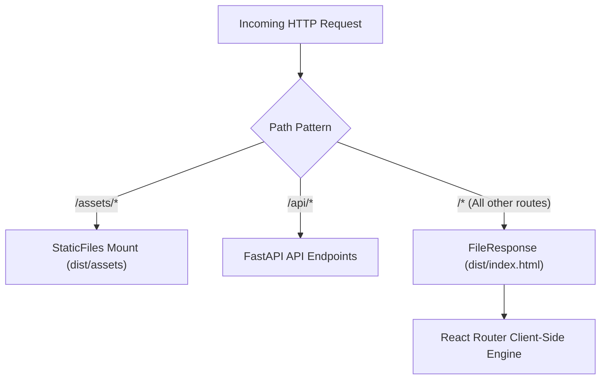

# Alternative Host Architecture

This document details the single-service unified hosting architecture implemented in `alternative-host/`.

---

## 1. Unified Single-Container Architecture

### Key Architectural Patterns:
1. **Static Assets Mount**:
   Mounted at `/assets` using FastAPI's `StaticFiles(directory=dist/assets)`.
2. **Catch-All Fallback Handler**:
   Decorated with `@app.get("/{full_path:path}")`. Returns `dist/index.html` with status `200` to allow client-side routers (React Router) to handle nested paths without 404 errors.
3. **Build Pipeline Decoupling**:
   [`deploy.sh`](file:///home/victor/antigravity/Teacher-Assistant-Workspace/alternative-host/deploy.sh) orchestrates frontend compilation independently from Python runtime startup, ensuring the static distribution directory is verified prior to server boot.
4. **Containerization Security**:
   [`Dockerfile`](file:///home/victor/antigravity/Teacher-Assistant-Workspace/alternative-host/Dockerfile) employs multi-stage caching (`node:18-alpine` ➔ `python:3.13-slim`) to isolate build dependencies from the final minimal production image.
