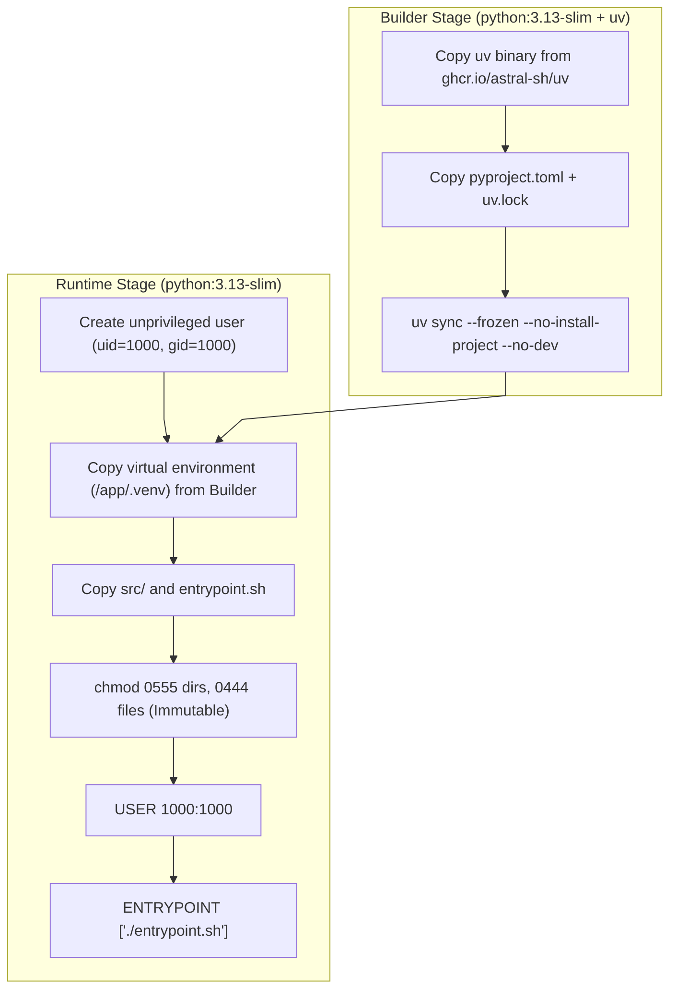

# Backend Root Architecture & Container Design

This document details the containerization, dependency architecture, and runtime initialization for the backend service in `backend/`.

---

## 1. Multi-Stage Container Build Pipeline

[`Dockerfile`](file:///home/victor/antigravity/Teacher-Assistant-Workspace/backend/Dockerfile) implements an optimized multi-stage build using Astral's `uv`:

---

## 2. Toolchain & Task Orchestration Contracts

- **Toolchain**: Managed exclusively through `uv`. Direct `pip` invocations are strictly disallowed.
- **Task Runner (`poe`)**: Tasks configured in [`pyproject.toml`](file:///home/victor/antigravity/Teacher-Assistant-Workspace/backend/pyproject.toml) enforce uniform command invocations:
  - `poe lint`: Sequentially executes `ruff check .` and `basedpyright .`.
  - `poe format`: Runs `ruff format .`.
  - `poe run-dev`: Starts `uvicorn src.main:app --host 0.0.0.0 --port 8090 --reload`.
- **Runtime Permissions**: [`entrypoint.sh`](file:///home/victor/antigravity/Teacher-Assistant-Workspace/backend/entrypoint.sh) ensures unprivileged execution while allowing dynamic CLI arguments to pass through to Uvicorn.
