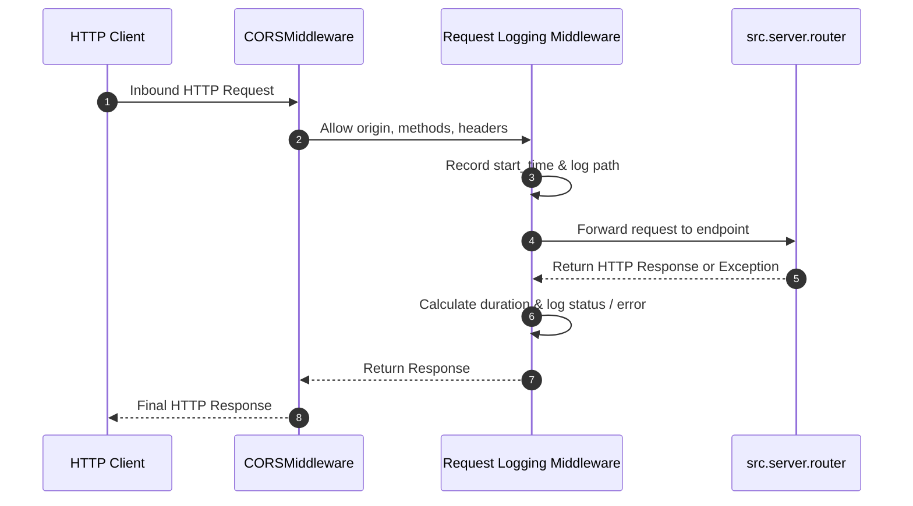

# Backend Entrypoint Architecture

This document details the initialization sequence and middleware pipeline implemented in `backend/src/`.

---

## 1. Middleware Pipeline & Request Flow

---

## 2. Key Design Patterns in `main.py`

1. **Explicit CORS Policy**: Permissive configuration (`allow_origins=["*"]`, `allow_credentials=True`) facilitating browser interactions across ports and microservice containers.
2. **Asynchronous HTTP Logging Middleware**: Wraps every request in a `try/except` block to capture execution duration, status code, and full tracebacks on unhandled failures without modifying endpoint logic.
3. **Router Delegation**: Keeps `main.py` purely focused on server setup and middleware assembly, delegating all domain endpoints to `src.server.router`.
