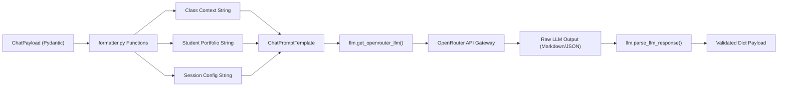

# Backend Library Architecture & LLM Integration

This document details the interface contracts, transformation patterns, and LLM communication designs implemented in `backend/src/lib/`.

---

## 1. Prompt Transformation & LLM Gateway Architecture



---

## 2. Component Design & Structural Invariants

### 1. `formatter.py` Pure Functions:
- **`format_classroom_context(payload)`**: Serializes active workspace metadata, subject, teacher name, teaching style, materials list, and instructional rubrics into markdown lists.
- **`format_students_context(students)`**: Formats student records, performance indicators, attendance percentages, grades, custom attributes, and parent notes.
- **`format_analysis_config_context(config)`**: Formats targeted analysis types, scope filters, and custom instructions.

### 2. `llm.py` Transport & Sanitization:
- **`get_openrouter_llm(model, api_key)`**: Instantiates `ChatOpenAI` configured with OpenRouter `base_url`, custom referrer headers (`HTTP-Referer`, `X-Title`), and fixed temperature (`0.7`).
- **`parse_llm_response(raw_content)`**: Implements defensive JSON extraction by stripping leading/trailing markdown code fences (```json ... ```) prior to `json.loads` parsing.

### 3. `logger.py` Observability & Diagnostic Engine:
- **Request ID Tracing**: ContextVar-backed `RequestIdFilter` injects active `x-request-id` into all log records across thread-local and async tasks.
- **Coordinated Cohort Rotation**: Synchronizes file rotation across human-readable `.log`, dedicated `-error.log`, and structured `.jsonl` streams every 5,000 primary entries.
- **Structured JSON Lines Formatting**: Serializes log level, timestamp, logger name, message, request ID, duration, and exception tracebacks into ndjson format for automated log analysis.
- **Execution Telemetry**: `measure_async` context helper measures async execution durations in milliseconds and logs performance metrics.
