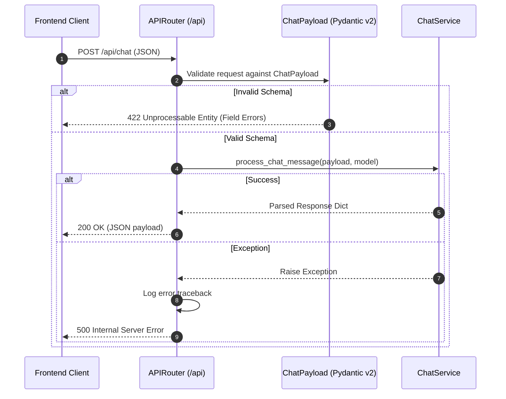

# Server Layer Architecture & Routing Contracts

This document details the route architecture, validation boundaries, and exception mappings in `backend/src/server/`.

---

## 1. Request Dispatch & Error Mapping Architecture

---

## 2. Interface Contracts & Design Principles

1. **Schema-First Validation**: All request bodies are strictly bound to Pydantic v2 models (`ChatPayload`, `GradeRequest`, `MaterialAnalyzeRequest`). FastAPI automatically generates OpenAPI schema documentation and rejects invalid payloads before code execution.
2. **Environment Configuration**: Default model resolution leverages `os.getenv("OPENROUTER_MODEL", "google/gemini-2.5-flash")`, ensuring model selection can be swapped without code redeployments.
3. **Clean Layer Separation**: Route handlers contain zero business logic or direct LLM prompt manipulation, strictly delegating domain workflows to `src.service.chat.ChatService` and `src.service.evaluator.EvaluatorService`.

