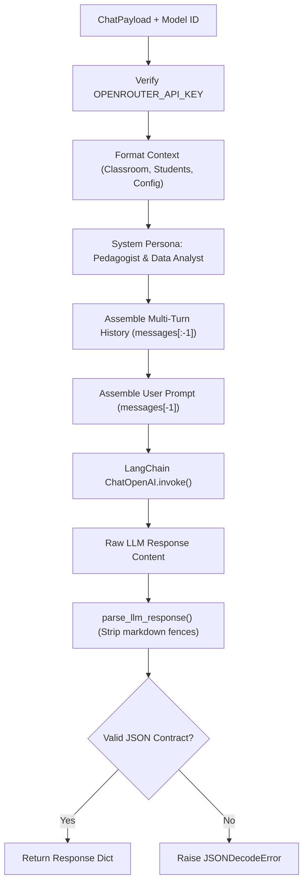

# Service Layer Architecture & Prompt Orchestration

This document details the service architecture, prompt composition contracts, and response parsing pipeline implemented in `backend/src/service/`.

---

## 1. `ChatService` Execution Pipeline



---

## 2. Prompt Architecture & Response Contracts

### System Prompt Structure:
The system persona instructs the model to return a strict JSON payload matching:
```json
{
  "text": "Markdown-formatted pedagogical feedback, tables, or diagnostics",
  "visualization": {
    "type": "charts" | "heatmap" | "ranking" | "timeline" | "stats",
    "title": "Visualization title",
    "description": "Subtitle metrics description",
    "data": []
  }
}
```
If no visualization applies, `"visualization"` is returned as `null`.

### Error Handling & Fallbacks:
`ChatService` and `EvaluatorService` follow the **EAFP** (Easier to Ask for Forgiveness than Permission) principle for accessing environment variables, logging critical parameter states before delegating execution to the LLM client, and catching parsing anomalies to prevent silent model hallucinatory formatting bugs.

## 3. `EvaluatorService` Autonomous Grading & Ingestion Flow
- **Auto-Grading (`grade_submission`)**: Evaluates raw submission text against `rubric_criteria`, generates structured item-by-item `RubricBreakdownItem` scores, creates encouraging student feedback, and isolates private pedagogical notes for teacher review.
- **Material Analysis (`analyze_material`)**: Inspects material content, generates syllabus standards alignments, diagnoses prerequisite concept gaps, and constructs sample comprehension questions with answer keys.
- **Ontology Operations (`OntologyService`)**: Converts domain entities into formatted knowledge graph records for the private `ai` PostgreSQL schema.

