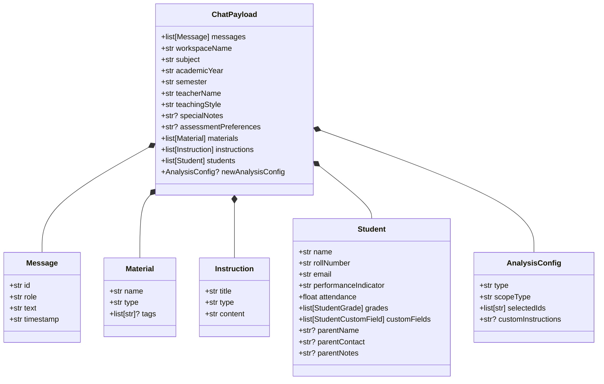

# Backend Type Architecture & Data Contracts

This document details the data modeling design, runtime validation boundaries, and database type mappings implemented in `backend/src/types/`.

---

## 1. Schema Hierarchy & Model Composition

---

## 2. Key Architectural Invariants

1. **Pydantic v2 Contract Boundaries (`schemas.py`, `ai.py`)**:
   - Uses strict field definitions (`BaseModel`) with default empty collections (`= []`) and optional string defaults (`= ""`), eliminating `NoneType` attribute errors during downstream string formatting.
   - `ai.py` models enforce non-Any typed interfaces for rubric evaluation requests, structured feedback breakdowns, prerequisite gap outputs, and ontology knowledge representations.
   - Provides runtime deserialization and validation at FastAPI endpoint ingress points.
2. **Database Types Invariant (`db.py`)**:
   - Generated mechanically by `scripts/_generate_types.py`. Manual edits are discouraged to maintain synchronization with PostgreSQL DDL.
   - Declares `TypedDict` models representing `Row`, `Insert`, and `Update` structures for all database tables and views.

