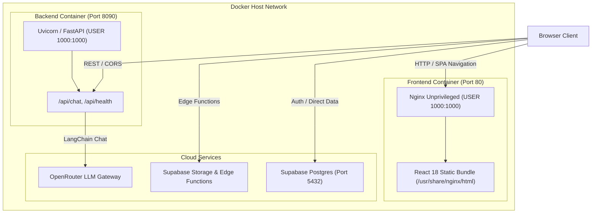

# Root Workspace Architecture & Container Orchestration

This document details the architectural patterns, structural design, container orchestration, and security boundaries established at the root level of the **Teach&Learn** workspace.

---

## 1. Multi-Container Orchestration Architecture

The workspace root coordinates two decoupled application services via Docker Compose:

### Composition Model:
1. **`docker-compose.yml` (Base Production Blueprint)**:
   - Sets non-root user execution (`user: "1000:1000"`).
   - Configures read-only code bindings and healthcheck policies.
   - Restricts port exposure to `80:80` (Frontend) and `8090:8090` (Backend).
2. **`docker-compose.dev.yml` (Development Layer)**:
   - Overlays volume mounts from the host filesystem (`./frontend:/app`, `./backend:/app`) into containers for live hot-reloading.
   - Injects development environment parameters and debug tooling.

---

## 2. Security & Immutability Architecture

- **Rootless Container Execution**: All processes execute under UID/GID `1000:1000`, removing host root vulnerability vectors.
- **Read-Only / Immutable Permissions**: In production containers, directories are mapped `0555` (read+execute) and files `0444` (read-only), preventing runtime script injection or file modification.
- **Strict Environment Isolation**: Secret files (`.env`, `.env.local`) are excluded by [`.gitignore`](file:///home/victor/antigravity/Teacher-Assistant-Workspace/.gitignore). Containers ingest secrets dynamically via `.env` injection defined in Compose.

---

## 3. Configuration & Type Verification Contracts

- **`pyrightconfig.json`**: Enforces strict Python 3.13 type-checking boundaries across `backend/` and `scripts/`, specifying exclusion filters for virtual environments (`.venv`, `.uv_python`).
- **`tsconfig.json`**: Root TypeScript configuration providing project references and compiler options for frontend client code and build tooling.
- **`vercel.json`**: Provides edge rewrites and single-page application (SPA) fallback rules for external serverless static deployments.
- **`AGENTS.md`**: Root of the hierarchical rule cascading system, setting universal coding standards and repository invariants for all submodules.
