# Frontend Rules & Guidelines — React 18 / Vite / TypeScript

This document defines the rules, conventions, and operational practices for the **Teach&Learn** frontend application in `frontend/`. These rules cascade from and specialize the universal workspace principles defined in the root [`/AGENTS.md`](file:///home/victor/antigravity/Teacher-Assistant-Workspace/AGENTS.md).

---

## 1. Toolchain & Core Stack

- **Framework**: React 18 with Vite and TypeScript.
- **Type Safety**: Strict mode enabled (`"strict": true` in `tsconfig.json`). Zero tolerance for `any` types. Define explicit types for props, state, and API contracts.
- **Icons**: `lucide-react` for all iconography.
- **Styling**: Tailwind CSS with custom theme variables.
- **Backend & Database Clients**:
  - Supabase JS Client (`@supabase/supabase-js`) in `src/lib/supabase.ts`.
  - Backend REST API clients encapsulated in `src/services/`.

---

## 2. Directory Structure & Component Boundaries

Source code is organized cleanly in `frontend/src/`:

```
frontend/src/
├── components/       # Modular UI components (Navigation, Modals, Views, Cards)
│   └── ui/           # Atomic reusable primitive controls (Button, Badge, Input)
├── contexts/         # React Context Providers (ThemeContext, AuthContext, etc.)
├── hooks/            # Custom hooks encapsulating stateful workflows & data fetching
├── services/         # Typed HTTP clients for FastAPI backend routes
├── lib/              # Supabase client, shared theme tokens, utility helpers
└── types/            # Domain interfaces, union types, and API response contracts
```

### Component Design & Separation of Concerns:
1. **Single Responsibility**: Each component must have a single clear rendering/interaction purpose.
2. **Derive State Over Redundant Synchronization**: Calculate computed values directly from existing props/state rather than storing duplicate synced state.
3. **Controlled Inputs**: Use controlled forms and inputs with explicit change handlers.
4. **No Inline Style Bloat**: Avoid inline `style={{ ... }}` unless computing dynamic coordinates/dimensions not expressible with Tailwind classes.

---

## 3. Tailwind CSS Consolidation Rules

To eliminate repetitive JSX `className` bloat and maintain a coherent design system, use this 4-tier consolidation pattern:

```mermaid
%%{init: {'flowchart': {'curve': 'linear'}}}%%
flowchart TD
    A["Repetitive Utility Pattern"] --> B{"Interactive UI control with variants?"}
    B -- Yes --> C["1. Atomic UI Primitive (<Button>, <Badge>, <Input>)"]
    B -- No --> D{"Recurring layout / structural container?"}
    D -- Yes --> E["2. CSS @apply in index.css (@layer components)"]
    D -- No --> F{"Shared configuration / theme token string?"}
    F -- Yes --> G["3. Shared Style Dictionary (src/lib/themeStyles.ts)"]
    F -- No --> H["4. Class Variance Authority (cva) + tailwind-merge"]
```



1. **Atomic UI Component Primitives** (`src/components/ui/`):
   - Encapsulate base classes, variant maps (`primary`, `secondary`, `danger`, `ghost`), and sizes in typed components (e.g. `<Button>`, `<Input>`, `<Badge>`).
2. **Global Component Classes via `@apply`** (`src/index.css`):
   - Reserve for universal page containers, modal backdrops, and surface card classes (`.card-surface`, `.btn-primary`, `.input-field`).
3. **Class Variance Authority (`cva`) + `tailwind-merge`**:
   - Use for complex multi-variant components requiring safe class composition without collision.
4. **Shared Style Constant Dictionaries** (`src/lib/themeStyles.ts`):
   - Extract recurring multi-class layout configurations into shared constant objects.

---

## 4. UI Element ID Traceability (Mandatory)

To ensure automated end-to-end testing and DOM inspectability:
- Every interactive element (buttons, text inputs, selects, modals, tabs) **must have an explicit `id` attribute**.
- **Naming Pattern**: `<feature-scope>-<action>` (e.g., `sidebar-collapse-btn`, `class-details-edit-btn`, `rag-query-input`).
- **Dynamic Items**: Suffix with the item's unique key (e.g., `sidebar-class-item-${classItem.id}`).
- **Documentation**: Whenever adding or modifying interactive elements or modals, document them in [frontend/UI_ELEMENT_IDS.md](file:///home/victor/antigravity/Teacher-Assistant-Workspace/frontend/UI_ELEMENT_IDS.md).

---

## 5. Theme & Accessibility Standards

- Support both **Light** and **Dark** themes seamlessly using Tailwind `dark:` variants and CSS color variables.
- Use semantic HTML tags (`<button>`, `<nav>`, `<aside>`, `<main>`, `<header>`, `<fieldset>`).
- Maintain WCAG contrast standards and keyboard accessibility (`Esc` to dismiss modals, `Enter` to submit forms, proper focus rings).

---

## 6. Build & Quality Verification

Before declaring any frontend task complete, execute the TypeScript compilation and Vite production build check:

```bash
cd frontend && npm run build
```
Ensure zero TypeScript compilation errors or bundling warnings.
