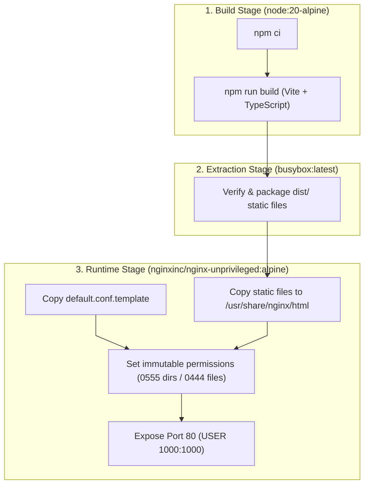

# Frontend Root Architecture & Build Toolchain

This document details the build lifecycle, container architecture, and Nginx deployment configuration for the frontend in `frontend/`.

---

## 1. Multi-Stage Container & Asset Delivery Architecture

[`Dockerfile`](file:///home/victor/antigravity/Teacher-Assistant-Workspace/frontend/Dockerfile) utilizes a three-stage build pipeline:

---

## 2. Key Architecture Invariants

1. **SPA Fallback Routing**:
   [`default.conf.template`](file:///home/victor/antigravity/Teacher-Assistant-Workspace/frontend/default.conf.template) directs non-file requests to `/index.html` via `try_files $uri $uri/ /index.html;`, enabling client-side routing across stateful application paths.
2. **Environment Variable Injection**:
   Client-side variables prefixed with `VITE_` (`VITE_SUPABASE_URL`, `VITE_SUPABASE_ANON_KEY`) are baked into the static bundle during `npm run build` by Vite.
3. **UI Element ID Traceability**:
   As mandated in [`AGENTS.md`](file:///home/victor/antigravity/Teacher-Assistant-Workspace/frontend/AGENTS.md) and indexed in [`UI_ELEMENT_IDS.md`](file:///home/victor/antigravity/Teacher-Assistant-Workspace/frontend/UI_ELEMENT_IDS.md), interactive DOM elements carry unique predictable IDs for testing and automation.
