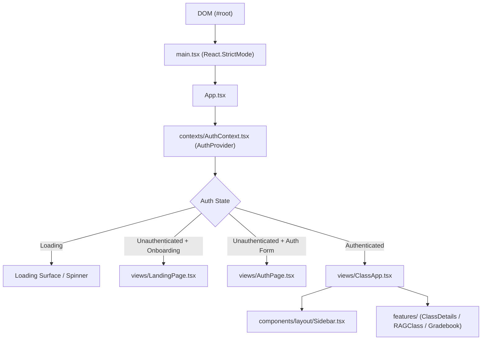

# Frontend Core Application Architecture

This document details the application lifecycle, context hierarchy, routing transitions, and design system contracts in `frontend/src/`.

---

## 1. Application Lifecycle & Component Tree Hierarchy

---

## 2. Design System & CSS Token Architecture (`index.css`)

1. **CSS Variables for Theme Switching**:
   - Variables (`--bg-primary`, `--surface-card`, `--border-color`, `--text-primary`) dynamically update between light and dark modes via `.dark` class toggling on `<html>`.
2. **Four-Tier Tailwind Consolidation**:
   - Level 1: Atomic UI primitives (`src/components/ui/`).
   - Level 2: Recurring structural classes via `@apply` in `index.css` (`.card-surface`, `.btn-primary`, `.input-field`).
   - Level 3: Theme dictionaries in `src/lib/themeStyles.ts`.
   - Level 4: Dynamic class composition via `clsx` and `tailwind-merge`.
3. **Scrollbar & Focus Ring Standardization**:
   - Provides unified slim scrollbars and WCAG-compliant accessible focus outlines across browsers.
