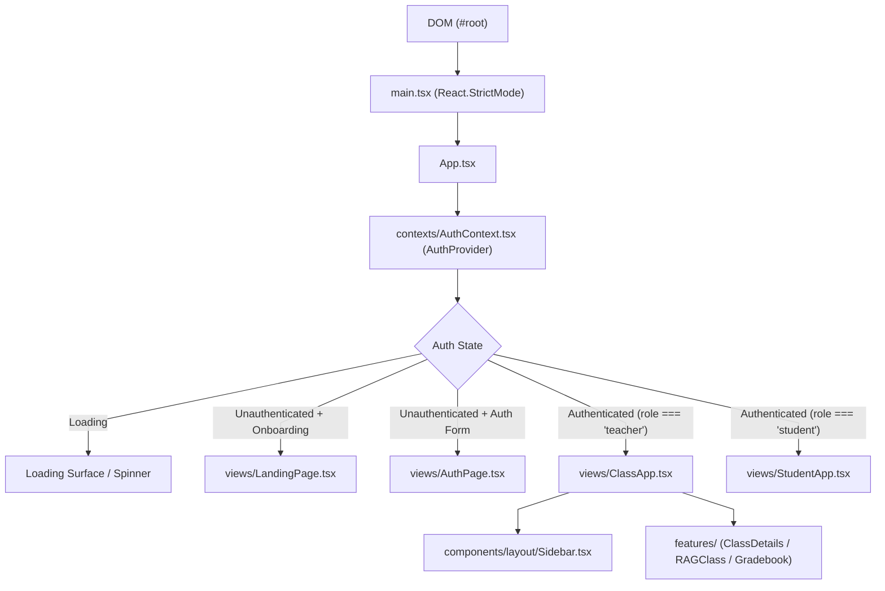

# Frontend Core Application Architecture

This document details the application lifecycle, context hierarchy, routing transitions, and design system contracts in `frontend/src/`.

---

## 1. Application Lifecycle & Component Tree Hierarchy

```mermaid
%%{init: {'flowchart': {'curve': 'linear'}}}%%
flowchart TD
    DOM["DOM (#root)"] --> Main["main.tsx (React.StrictMode)"]
    Main --> App["App.tsx"]
    App --> AuthProvider["contexts/AuthContext.tsx (AuthProvider)"]
    
    AuthProvider --> AuthState{"Auth State"}
    AuthState -- "Loading" --> LoadingSpinner["Loading Surface / Spinner"]
    AuthState -- "Unauthenticated + Onboarding" --> Landing["views/LandingPage.tsx"]
    AuthState -- "Unauthenticated + Auth Form" --> Auth["views/AuthPage.tsx"]
    AuthState -- "Authenticated (role === 'teacher')" --> ClassApp["views/ClassApp.tsx"]
    AuthState -- "Authenticated (role === 'student')" --> StudentApp["views/StudentApp.tsx"]
    
    ClassApp --> Sidebar["components/layout/Sidebar.tsx"]
    ClassApp --> ViewModes["features/ (ClassDetails / RAGClass / Gradebook)"]
```

---

## 2. Design System & CSS Token Architecture (`index.css`)

1. **CSS Variables for Theme Switching**:
   - Variables (`--background`, `--surface`, `--elevated`, `--border-color`, `--primary`, `--primary-text`) dynamically update between light and dark modes via `.dark` class toggling on `<html>`.
2. **Three-Tier Tailwind Consolidation**:
   - Level 1: Atomic UI primitives (`src/components/ui/`) using template literal class composition.
   - Level 2: Component utility classes in `index.css` (`.card-surface`, `.btn-primary`, `.input-field`).
   - Level 3: Design token dictionaries in `src/lib/themeStyles.ts`.
3. **Scrollbar & Focus Ring Standardization**:
   - Provides unified slim scrollbars and WCAG-compliant accessible focus outlines across browsers.
