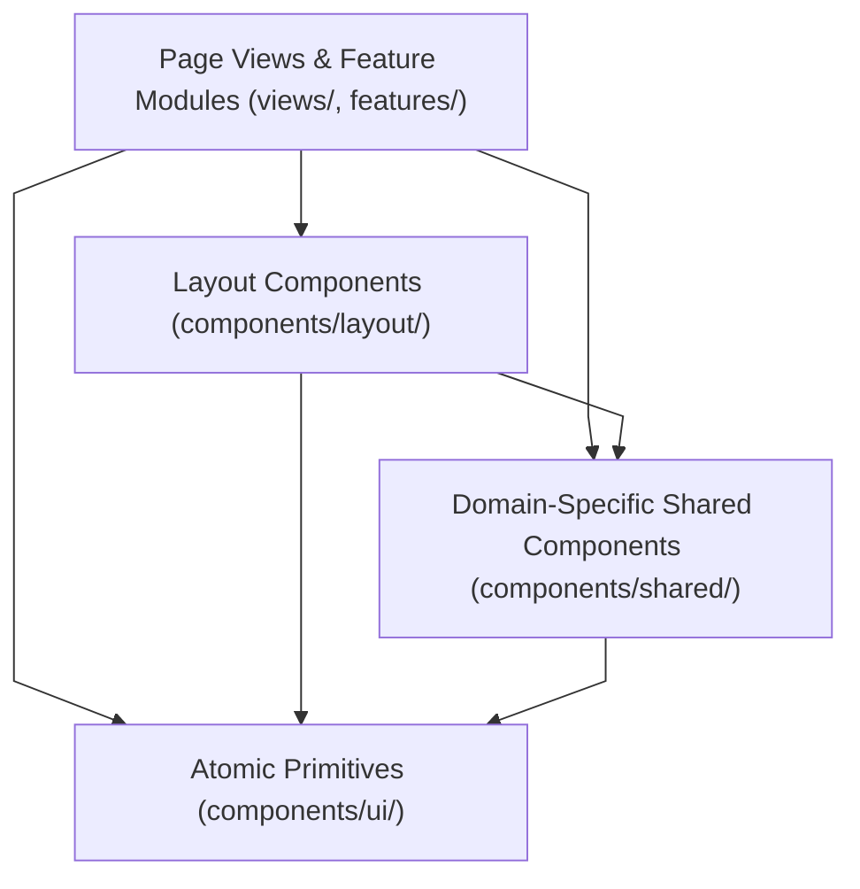

# Component Layer Architecture & Hierarchy

This document outlines the three-tier component separation architecture in `frontend/src/components/`.

---

## 1. Component Layering Model

### Layer Responsibilities:
1. **Atomic Primitives (`ui/`)**: Zero domain awareness. Strictly render styled primitives based on props.
2. **Domain Shared (`shared/`)**: Encapsulate multi-step input logic, autocomplete search algorithms, and composite dialog layouts.
3. **Application Layout (`layout/`)**: Manage global view transitions, sidebar collapse states, and command palette event listeners.
