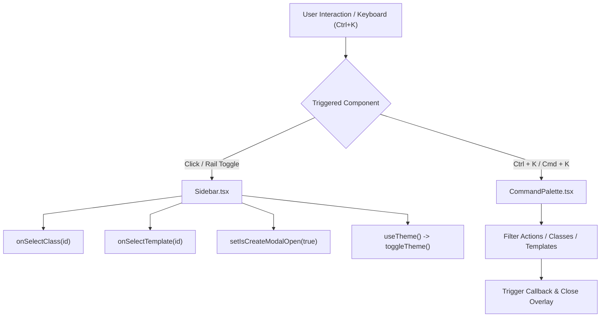

# Layout Architecture & Navigation State

This document details the navigation state model, keyboard shortcuts, and responsiveness contracts for `frontend/src/components/layout/`.

---

## 1. Navigation & State Dispatch Flow

---

## 2. Key Architecture & Accessibility Patterns

1. **Collapsible Navigation Rail (`Sidebar.tsx`)**:
   - Manages an internal `isCollapsed` state with persistent CSS transitions.
   - Preserves icon readability in collapsed mode and renders rich metadata (student counts, term badges, archive tags) in expanded mode.
   - Complies with explicit DOM element ID naming conventions (`sidebar-collapse-button`, `sidebar-search-input`, `sidebar-class-item-${id}`).
2. **Modal Backdrop & Keyboard Traps (`CommandPalette.tsx`)**:
   - Attaches a global `keydown` event listener to `window` for `Ctrl+K` and `Cmd+K`.
   - Closes on `Escape` keypress or background backdrop click.
   - Groups results logically into "Navigation", "Classes", "Templates", and "System Actions" with arrow key navigation support.
