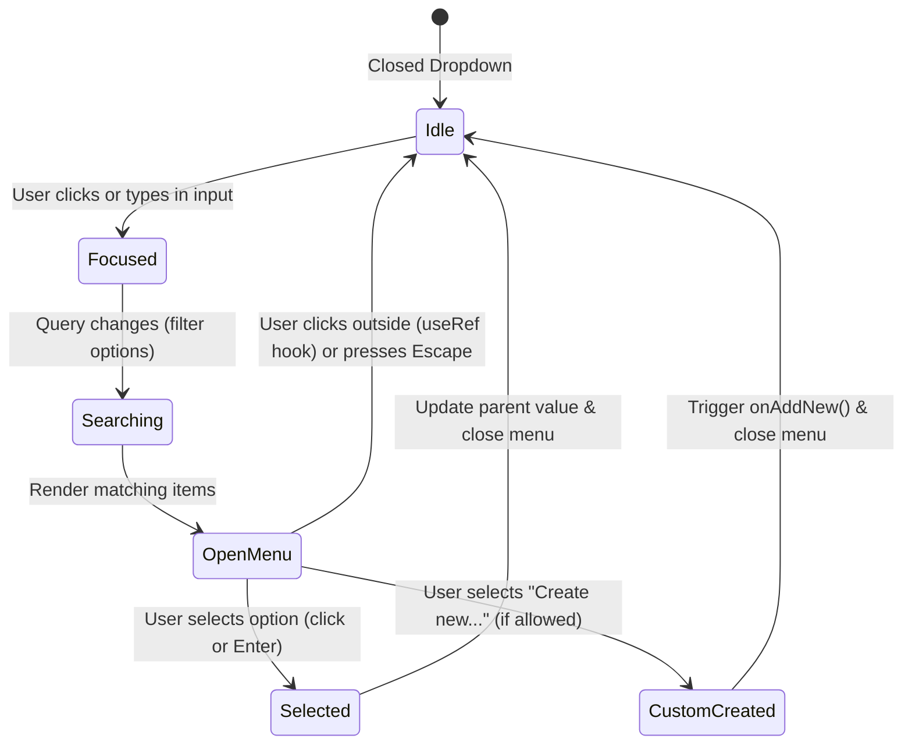

# Shared Components Architecture & State Flow

This document details the interface contracts, dropdown architectures, and autocompletion state models in `frontend/src/components/shared/`.

---

## 1. Autocomplete & Multi-Select State Machine

---

## 2. Component Design & Prop Invariants

1. **`InstituteAutocompleteField.tsx`**:
   - Integrates with database `institutes` records.
   - Decouples selecting an existing institute from registering a new institute inline via the `onAddNew` callback.
2. **`MultiSelect.tsx`**:
   - Controlled component accepting `selected: string[]` and emitting `onChange(newValues: string[])`.
   - Renders removable badge chips inline and handles keyboard tag deletion via Backspace.
3. **`CustomDialogs.tsx`**:
   - Encapsulates confirmation dialogs (`title`, `message`, `confirmLabel`, `cancelLabel`, `isDestructive`) on top of atomic `<Modal>` primitives.
   - Prevents accidental background closure during async pending operations.
