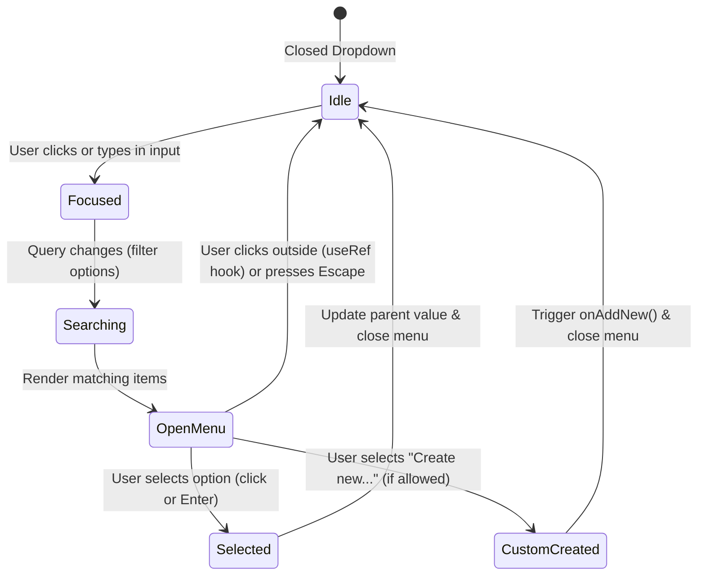

# Shared Components Architecture & State Flow

This document details the interface contracts, dropdown architectures, and autocompletion state models in `frontend/src/components/shared/`.

---

## 1. Autocomplete & Multi-Select State Machine

---

## 2. Component Design & Prop Invariants

1. **`InstituteAutocompleteField.tsx`**:
   - Consumes `instituteService.fetchInstitutes()` to populate an in-memory client directory with 1-hour TTL caching.
   - Executes multi-token fuzzy matching instantaneously on keystrokes with zero network latency, supporting keyboard navigation (`ArrowDown`, `ArrowUp`, `Enter`, `Escape`).
2. **`MultiSelect.tsx`**:
   - Controlled component accepting `selected: string[]` and emitting `onChange(newValues: string[])`.
   - Renders removable badge chips inline and handles keyboard tag deletion via Backspace.
3. **`CustomDialogs.tsx` (`ConfirmModal`, `AlertModal` & `LoadingOverlay`)**:
   - Encapsulates confirmation and alert dialogs (`title`, `message`, `confirmLabel`, `cancelLabel`, `isDestructive`) on top of atomic `<Modal>` primitives.
   - `LoadingOverlay` supports `showProgressBar?: boolean`, `subMessage?: string`, and `progress?: number`, rendering an asymptotic progress bar (`15% → 92%`) with a percentage badge and an amber wait warning banner (`"Please do not close or refresh this window while the operation completes"`) for binary file uploads.
