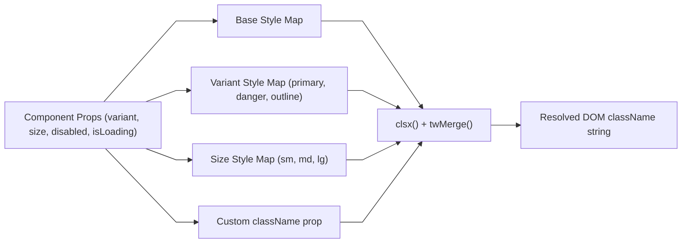

# Atomic UI Architecture & Variant Design

This document details the variant composition architecture, accessibility standards, and styling patterns in `frontend/src/components/ui/`.

---

## 1. Variant Composition & Styling Patterns

UI primitives utilize strict TypeScript interfaces combined with `clsx` and `tailwind-merge` (`twMerge`) to allow callers to pass custom `className` overrides without breaking component base styles:

---

## 2. Component Specifications & Invariants

1. **`Button.tsx`**:
   - Manages an `isLoading` prop that replaces prefix icons with an animated spinner SVG and sets `disabled={true}` to prevent duplicate submissions.
   - Forwards standard HTML button attributes (`onClick`, `type`, `id`).
2. **`Modal.tsx`**:
   - Manages portal rendering or centered overlay positioning with `z-50`.
   - Listens to `keydown` for `Escape` key dismissal when `isOpen={true}` and invokes `onClose()`.
   - Prevents click bubbling from inside the modal content to the backdrop.
3. **`Input.tsx`**:
   - Renders semantic `<label>` linked to `<input id={...}>` for screen-reader accessibility.
   - Dynamically styles error borders and displays an inline red error hint when `error` prop is present.
