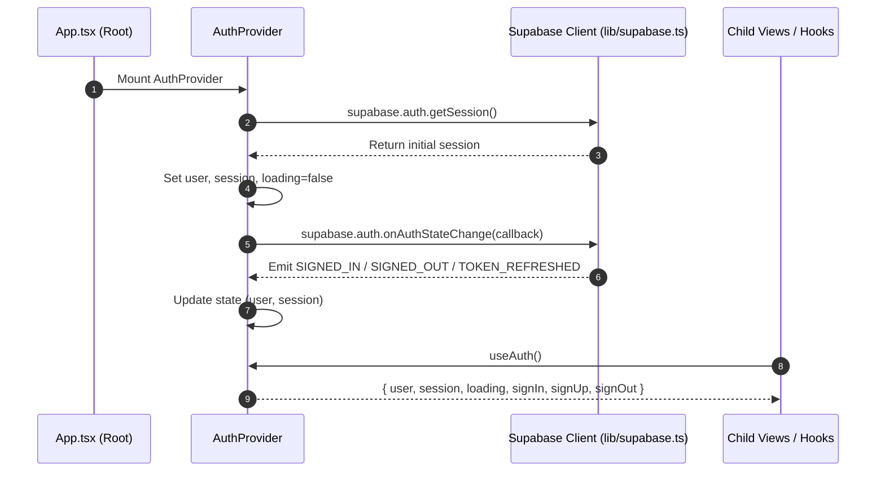

# Authentication Context Architecture

This document details the authentication state flow, Supabase session lifecycle, and hook contracts in `frontend/src/contexts/`.

---

## 1. Authentication Lifecycle & State Synchronization

---

## 2. Key Architectural Invariants

1. **Strict Context Guard**:
   `useAuth()` throws a descriptive error if invoked outside an `<AuthProvider>` ancestor, preventing undefined context bugs during testing or rendering.
2. **Session Persistence**:
   Relies on Supabase client's underlying browser storage adapter (localStorage) to transparently preserve JWT tokens between page reloads.
3. **Single Source of Truth**:
   The `onAuthStateChange` subscription guarantees that login, logout, and token expiration events propagate immediately throughout the component tree without manual page reloads.
