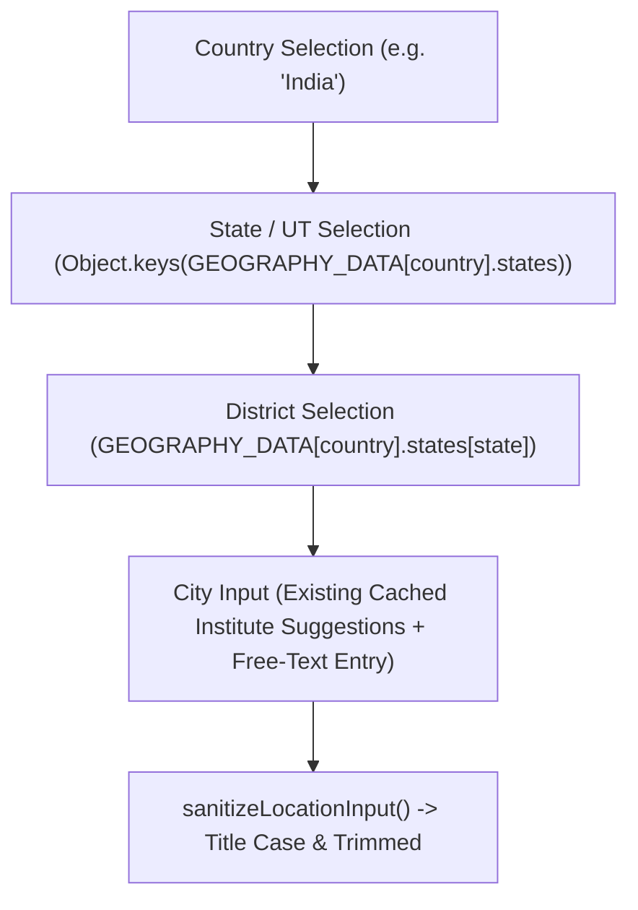

# Geographic Data Architecture & Cascading Invariants

This document details the interface contracts and cascading rules for geographical reference datasets in `frontend/src/data/`.

---

## 1. Geographic Cascading Flow

---

## 2. Invariants & Guarantees

1. **Deterministic Administrative Divisions**:
   - Indian districts are administrative entities; maintaining them locally prevents duplicate entries (e.g., `"bangalore"`, `"Bangalore Urban"`, `"BANGALORE"`) and cross-state mismatches (e.g., Selecting State: "Karnataka" and District: "Pune").
2. **Offline Availability**:
   - Dropdown options resolve synchronously without network latency or debouncing delays.
3. **Smart Free-Text Fallback**:
   - Cities, towns, and villages are unbounded. While District selection is restricted to legitimate administrative areas, City allows free-text input and automatically normalizes to Title Case via `sanitizeLocationInput()`.
