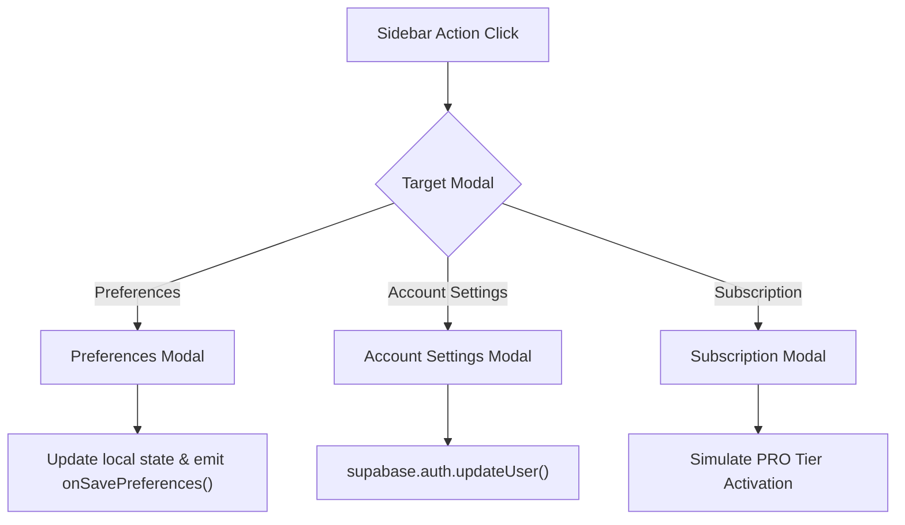

# Account Modals Architecture & Preferences State

This document details the modal state machine, profile updating flows, and form validation contracts in `frontend/src/features/account/`.

---

## 1. Account Settings & Preferences Flow

---

## 2. Component Design & State Handling

1. **Controlled State**:
   Modal forms maintain isolated local form state (`name`, `email`, `phone`, `currentPassword`, `newPassword`) while open, resetting when dismissed to prevent unsaved state pollution.
2. **Accessible Modals**:
   Uses `<Modal>` primitives with explicit `id` bindings (`account-settings-modal`, `preferences-modal`, `subscription-modal`) for UI testability.
3. **Blocking Security Progress Bar (`AccountModals.tsx`)**:
   During password updates (`isSavingPassword`), form inputs and modal dismissal are locked (`!isSavingPassword`) and an indeterminate security progress bar (`"Encrypting credentials and refreshing session tokens — please wait..."`) is rendered until Supabase Auth finishes rotating session tokens.
