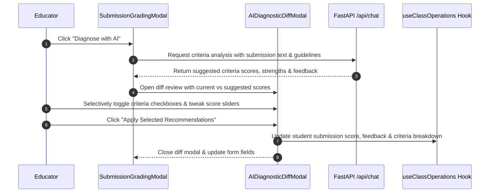

# AI Assistant Architecture & Diagnostic Review Flow

This document details the chat state flow, auto-grading diff review pipelines, and visualization renderers in `frontend/src/features/ai-assistant/`.

---

## 1. AI Diagnostic & Diff Review Architecture

---

## 2. Component Design & Visualization Contracts

### 1. `RAGClass.tsx`:
- Integrated with `useAIChat` custom hook to manage active `sessionId`, prompt execution states (`isGenerating`), and message histories.
- Formats AI outputs with copyable markdown code blocks, quick-action reply chips, and export to `.md` files.

### 2. `AIDiagnosticDiffModal.tsx`:
- Provides visual delta badges (`+5 pts`, `-2 pts`) showing the difference between existing human grading and AI suggestions.
- Teachers maintain 100% human-in-the-loop control, selectively picking criteria before committing changes.

### 3. `Visualizer.tsx`:
- Implements a declarative strategy pattern rendering:
  - `ranking`: Ordered bar list comparing student score vs. class average.
  - `timeline`: Historical trend cards across assignment milestones.
  - `heatmap`: Color-coded mastery matrix across curriculum topics.
  - `stats`: Highlight metric cards.
