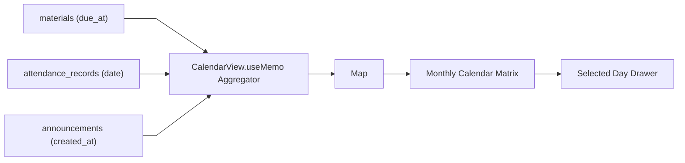

# Calendar Feature Architecture

This document describes the event aggregation architecture and calendar calculation patterns in `frontend/src/features/calendar/`.

---

## 1. Domain Event Aggregation

---

## 2. Invariants

- **No Third-Party Calendar Libs**: Uses zero external calendar dependencies for bundle efficiency.
- **Dynamic Aggregation**: Derives events from existing domain models (`Material`, `AttendanceRecord`, `Announcement`) without separate calendar sync tables.
