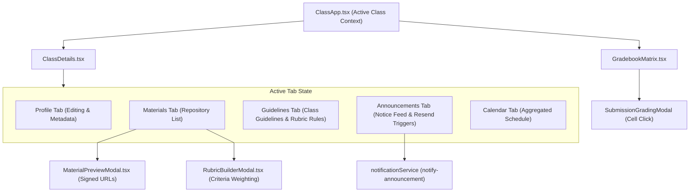

# Classroom Architecture & Gradebook Data Model

This document details the tab state management, rubric construction pipelines, and grade matrix calculations in `frontend/src/features/classroom/`.

---

## 1. Classroom State Architecture & Tab Management

---

## 2. Component Design & Mathematical Invariants

1. **Grading Criteria Builder Computation (`RubricBuilderModal.tsx`)**:
   - Maintains an array of `RubricCriterion` objects (`{ id, name, description, maxScore, weight }`).
   - Dynamically computes `totalMaxScore = sum(criteria.map(c => c.maxScore))` and displays scoring weights in real-time.
2. **Gradebook Matrix Virtualization & Filtering (`GradebookMatrix.tsx`)**:
   - Derives composite student grades by aggregating all `student_submissions` for the active class.
   - Computes weighted overall percentage and maps students to performance tiers (`High: >=85%`, `Average: 65-84%`, `At Risk: <65%`).
   - Offers client-side CSV generation with UTF-8 BOM encoding for direct spreadsheet import.
3. **Secure File Streaming (`MaterialPreviewModal.tsx`)**:
   - For private bucket files, calls the `get-material-url` Edge Function with `{ class_id, material_id, content_item_id }` to retrieve a short-lived signed URL, avoiding public asset exposure.
4. **0ms Optimistic Announcements & Resend Broadcasts (`ClassDetails.tsx`)**:
   - Posting an announcement immediately prepends a `temp-ann-*` card (`isPending: true`, rendering an animated `"Publishing..."` badge) to the feed and clears the composer in `0ms`.
   - `announcementService.createAnnouncement()` and `notificationService.notifyAnnouncement()` execute in the background; if insertion fails, `temp-ann-*` is evicted and the teacher's draft title/content are restored to the composer.
   - Deleting an announcement filters it out of the feed in `0ms` and restores the snapshot if `announcementService.deleteAnnouncement()` fails.
