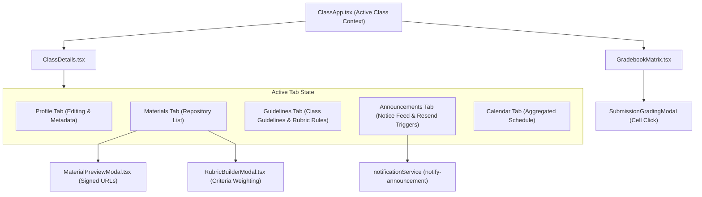

# Classroom Architecture & Gradebook Data Model

This document details the tab state management, rubric construction pipelines, and grade matrix calculations in `frontend/src/features/classroom/`.

---

## 1. Classroom State Architecture & Tab Management

```mermaid
%%{init: {'flowchart': {'curve': 'linear'}}}%%
flowchart TD
    ClassApp["ClassApp.tsx (Active Class Context)"] --> ClassDetails["ClassDetails.tsx"]
    
    subgraph Tabs["Active Tab State"]
        Profile["Profile Tab (Editing & Metadata)"]
        Materials["Materials Tab (Repository List)"]
        Instructions["Guidelines Tab (Class Guidelines & Rubric Rules)"]
        Announcements["Announcements Tab (Notice Feed & Resend Triggers)"]
        Calendar["Calendar Tab (Aggregated Schedule)"]
    end

    ClassDetails --> Tabs
    Materials --> PreviewModal["MaterialPreviewModal.tsx (Signed URLs)"]
    Materials --> RubricBuilder["RubricBuilderModal.tsx (Criteria Weighting)"]
    Announcements --> NotifyService["notificationService (notify-announcement)"]
    
    ClassApp --> Gradebook["GradebookMatrix.tsx"]
    Gradebook --> SubmissionGrading["SubmissionGradingModal (Cell Click)"]
```

---

## 2. Component Design & Mathematical Invariants

1. **Grading Criteria Builder Computation (`RubricBuilderModal.tsx`)**:
   - Maintains an array of `RubricCriterion` objects (`{ id, name, description, maxScore, weight }`).
   - Dynamically computes `totalMaxScore = sum(criteria.map(c => c.maxScore))` and displays scoring weights in real-time.
2. **Gradebook Matrix Virtualization & Filtering (`GradebookMatrix.tsx`)**:
   - Derives composite student grades by aggregating all `student_submissions` for the active class.
   - Computes weighted overall percentage and maps students to performance tiers (`High: >=85%`, `Average: 65-84%`, `At Risk: <65%`).
   - Offers client-side CSV generation with UTF-8 BOM encoding for direct spreadsheet import.
3. **Secure File Streaming (`MaterialPreviewModal.tsx`)**:
   - For private bucket files, calls the `get-material-url` Edge Function with `{ class_id, material_id, content_item_id }` to retrieve a short-lived signed URL, avoiding public asset exposure.
4. **0ms Optimistic Announcements & Resend Broadcasts (`ClassDetails.tsx`)**:
   - Posting an announcement immediately prepends a `temp-ann-*` card (`isPending: true`, rendering an animated `"Publishing..."` badge) to the feed and clears the composer in `0ms`.
   - `announcementService.createAnnouncement()` and `notificationService.notifyAnnouncement()` execute in the background; if insertion fails, `temp-ann-*` is evicted and the teacher's draft title/content are restored to the composer.
   - Deleting an announcement filters it out of the feed in `0ms` and restores the snapshot if `announcementService.deleteAnnouncement()` fails.
5. **Profile Tab Edit/Save/Cancel Controls & Always-Visible Materials/Guidelines CRUD (`ClassDetails.tsx`)**:
   - `isEditMode` in `ClassDetails.tsx` governs **only** the **Class Profile** tab (`class-details-tab-profile`).
   - The Edit, Save, and Cancel controls (`class-profile-edit-button`, `class-profile-save-button`, `class-profile-cancel-button`) are located directly inside the **Class Profile** tab header, completely isolating profile configuration from upper view navigation.
   - Add, edit, rubric-builder, and delete controls in the **Materials** tab (`materials-upload-file-button`, `Trash2` remove button) and **Class Guidelines** tab (`instructions-new-guideline-button`, `Trash2` delete button) are always visible and accessible without requiring Edit Mode.
6. **Multi-Mode Material Ingestion & Database Constraint Compliance (`ClassDetails.tsx`)**:
   - Materials creation supports 3 explicit ingestion modes:
     - `File`: uploads to `class-materials` at `/{teacher_user_id}/{material_id}/{content_item_id}`, recording `size_bytes` and `mime_type`.
     - `URL`: sets `path = url`, `type = 'URL'` without physical storage allocation.
     - `Text`: sets `path = ''`, `value = textContent`, `type = 'Text'` conforming to `valid_content_shape` (`validate_content_array`).
   - Graded assessment parameters strictly enforce the database check constraint `to_be_scored = false OR (due_at IS NOT NULL AND max_score IS NOT NULL)` prior to dispatch, requiring both `dueAt` and `maxScore` when `toBeScored` is true.
   - Forwards `notifyOnCreateMaterial` to `onAddMaterial` (`useClassOperations.handleAddMaterialInClass`) so student email notifications (`notify-material`) are triggered only after the `public.materials` row (`newMat.id`) is committed.
   - Dynamic size and type derivation (`classService.mapDbRowToClassModel`): Derives human-readable size (`MB`/`KB`/chars) and material type from `content[0]` rather than referencing non-existent table columns.
