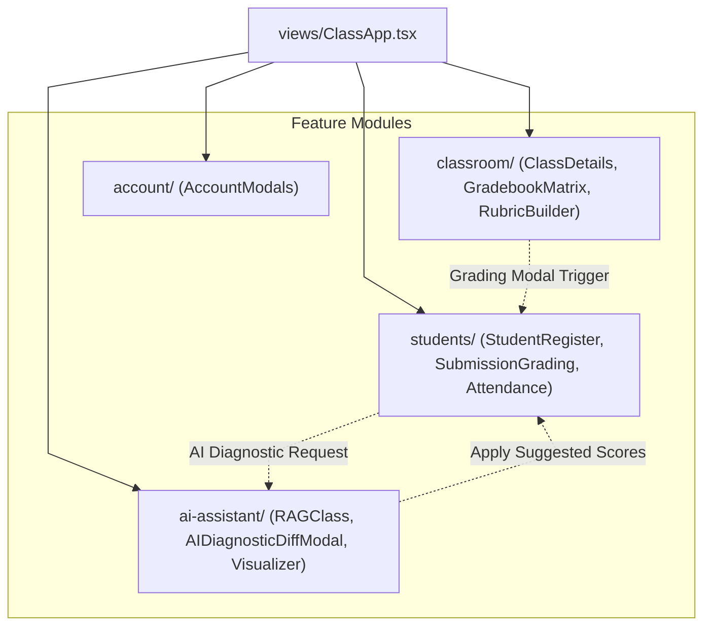

# Feature Architecture & Domain Boundaries

This document details the domain breakdown and cross-feature interaction patterns in `frontend/src/features/`.

---

## 1. Feature Interaction & Data Flow Architecture

---

## 2. Core Domain Invariants

1. **Feature Encapsulation**: Each feature folder contains self-contained modals, forms, and view panels that interact with shared state via hooks (`useClassOperations`, `useAIChat`, `useWorkspaceData`).
2. **Modal Portals & State Lift**: Complex sub-flows (e.g. AI-assisted grading) lift state to `ClassApp.tsx` or `useClassOperations.ts` to ensure consistent data persistence across classroom views.
