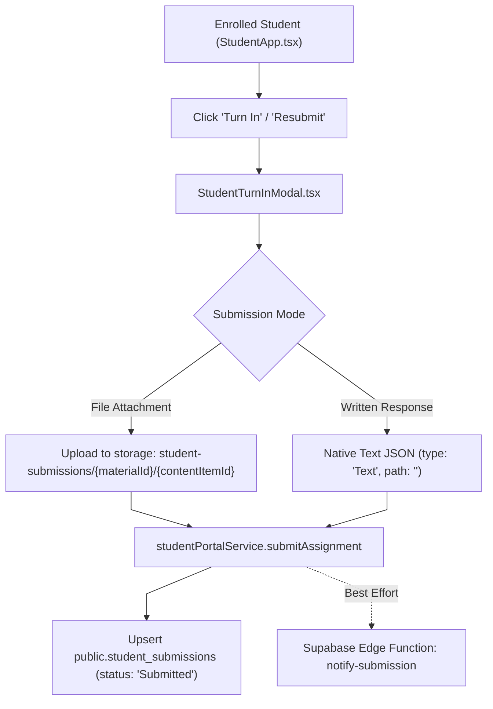

# Student Portal Feature Architecture

This document describes the component data flow and storage integration for student self-submission in `frontend/src/features/student-portal/`.

---

## 1. Submission Flow Architecture

---

## 2. Invariants

- **Storage Paths**: Files are uploaded to `student-submissions/{material_id}/{content_item_id}`.
- **Text Shape**: Clean `type: 'Text'`, `path: ''`, text in `value` field. No `text://` synthetic prefixes.
- **Row-Level Security**: Inserts and updates restricted to the authenticated student where `student_id = auth.uid()`.
