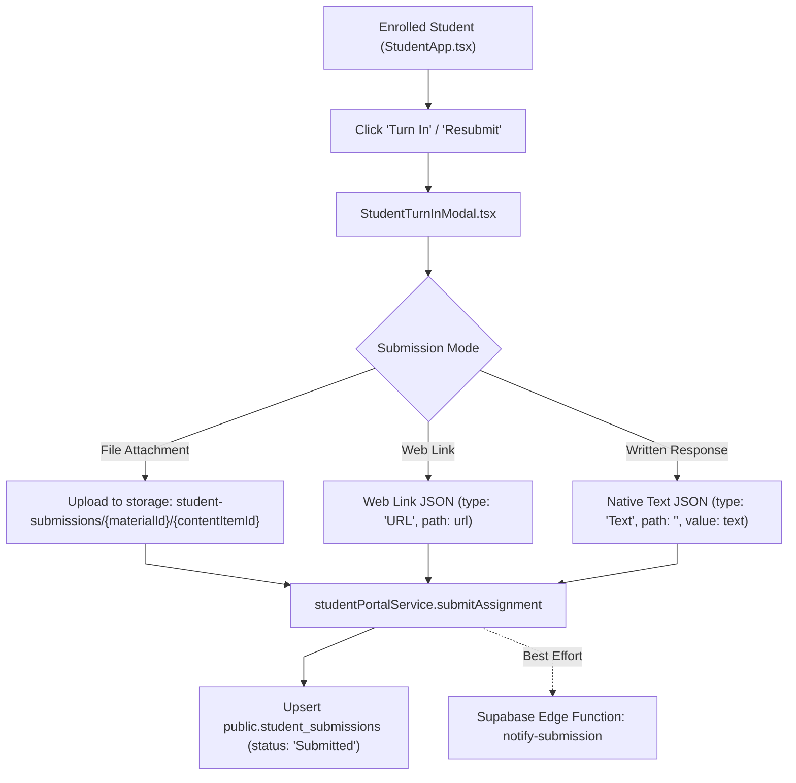

# Student Portal Feature Architecture

This document describes the component data flow and storage integration for student self-submission in `frontend/src/features/student-portal/`.

---

## 1. Submission Flow Architecture

```mermaid
%%{init: {'flowchart': {'curve': 'linear'}}}%%
flowchart TD
    Student["Enrolled Student (StudentApp.tsx)"] --> Click["Click 'Turn In' / 'Resubmit'"]
    Click --> Modal["StudentTurnInModal.tsx"]
    Modal --> Choice{"Submission Mode"}
    Choice -- File Attachment --> Storage["Upload to storage: student-submissions/{materialId}/{contentItemId}"]
    Choice -- Web Link --> UrlPayload["Web Link JSON (type: 'URL', path: url)"]
    Choice -- Written Response --> Payload["Native Text JSON (type: 'Text', path: '', value: text)"]
    Storage --> Service["studentPortalService.submitAssignment"]
    UrlPayload --> Service
    Payload --> Service
    Service --> DB["Upsert public.student_submissions (status: 'Submitted')"]
    Service -. Best Effort .-> Notify["Supabase Edge Function: notify-submission"]
```

---

## 2. Invariants

- **Storage Paths**: Files are uploaded to `student-submissions/{material_id}/{content_item_id}` with `size_bytes` and `mime_type`.
- **Text Shape**: Clean `type: 'Text'`, `path: ''`, text in `value` field. No `text://` synthetic prefixes.
- **Web Link Shape**: Clean `type: 'URL'`, `path: url`, with no physical storage allocation.
- **Hybrid UX Strategy (`StudentTurnInModal.tsx` & `StudentApp.tsx`)**:
  - **Written Text & URL Responses (`file === null`)**: Closes the modal in `0ms`, immediately emits a synthetic `StudentSubmission` (`status: 'Submitted'`) merged into `StudentApp.tsx` local state (eliminating the 4-query `loadClassData()` reload), and persists in the background.
  - **Binary File Attachments (`file !== null`)**: Locks modal dismissal (`!isSubmitting`) and renders an in-modal Blocking Progress Bar Overlay (`15% → 92% → 100%`) with formatted file size (`MB`/`KB`) and a wait warning until Supabase Storage completes the upload.
- **Single Non-Blocking Teacher Alert**: `studentPortalService.submitAssignment` triggers `notificationService.notifySubmission(resultData.id, classId)` once in the background after DB upsert, avoiding duplicate invocations from the modal component.
- **Row-Level Security**: Inserts and updates restricted to the authenticated student where `student_id = auth.uid()`.
