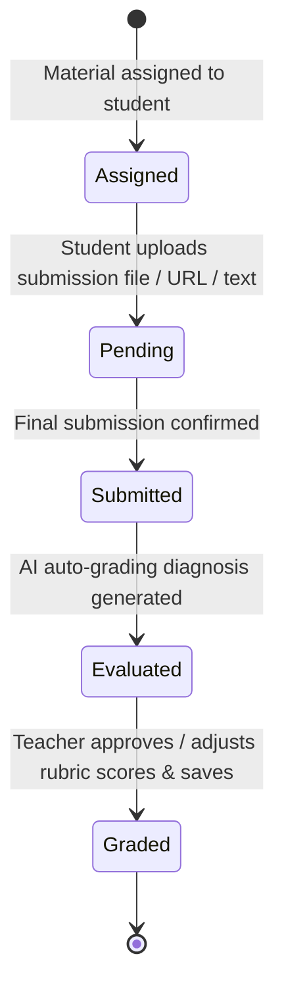
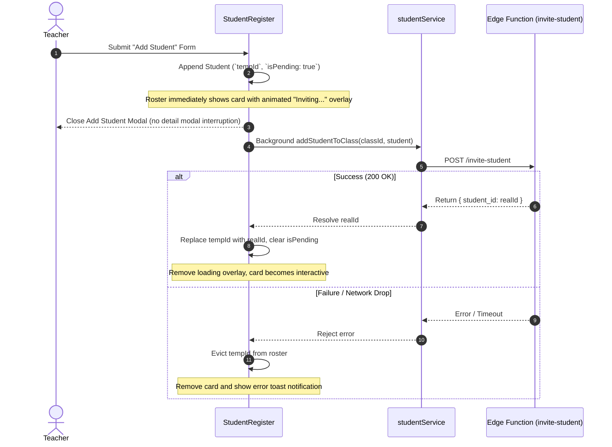

# Student Management Architecture & Submission Lifecycle

This document details the student data model, submission state machine, and grading pipeline in `frontend/src/features/students/`.

---

## 1. Submission Lifecycle & Grading Flow

---

## 2. Component Design & Scoring Invariants

1. **Criteria Breakdown Scoring (`SubmissionGradingModal.tsx`)**:
   - Calculates real-time total scores across criteria: `computedScore = sum(criteriaScores.map(c => c.score))`.
   - Compares against `material.maxScore` and computes student percentage grade `(computedScore / maxScore) * 100`.
2. **Attendance Calculation Invariant (`AttendanceManagerModal.tsx`)**:
   - Computes student attendance rate using standard weighted logic:
     $$\text{Attendance Rate} = \frac{\text{Present Count} + (0.5 \times \text{Late Count})}{\text{Total Recorded Sessions}} \times 100$$
3. **Printable Document Formatting & PDF Export (`ReportCardModal.tsx`)**:
   - Incorporates CSS `@media print` rules targeting `#report-card-printable`: hides all background UI (`body * { visibility: hidden }`), positions `#report-card-printable` at document origin, and preserves print colors (`print-color-adjust: exact`).
   - `handlePrint` dynamically sets `document.title` to `Report_Card_<Student>_<Course>` before invoking `window.print()`, guaranteeing the browser's "Save as PDF" destination generates properly named PDF files, and cleanly restores original title.
   - Textarea inputs switch to full `whitespace-pre-wrap` blocks during print to prevent truncated briefing notes, and `print-avoid-break` prevents awkward page splitting across cards and signatures.

---

## 3. Optimistic Roster Enrolment Lifecycle

---

## 4. Optimistic Mutations & Hybrid Upload Progress (Plan 12)

1. **Closure-Safe Concurrent Mutations (`classItemRef` in `StudentRegister.tsx`)**:
   - All background mutations (`handleAddStudent`, `handleSaveEvaluation`, `handleUpdateStudentDetails`, `handleDeleteStudent`) read and mutate `classItemRef.current`, capturing a pre-mutation snapshot (`previousClassSnapshot`) so concurrent saves never overwrite each other and automatically roll back on failure.
2. **0ms Optimistic Attendance Batch Logging (`AttendanceManagerModal.tsx`)**:
   - `handleSaveAttendance` immediately calculates updated student attendance histories and rates in memory, calls `onUpdateStudents(updatedStudents)` and `onClose()` in `0ms`, and runs `studentService.bulkLogAttendance` in the background with snapshot rollback on failure.
3. **Hybrid Submission Upload (`StudentSubmissionUploadModal.tsx`)**:
   - **Text/URL Submissions**: Dismiss the modal in `0ms`, emit a synthetic `StudentSubmission` to update the roster immediately, and persist in the background.
   - **Binary File Uploads (`file !== null`)**: Lock modal dismissal (`!isSubmitting`) and render an in-modal Blocking Progress Bar Overlay (`15% → 92% → 100%`) with formatted file size (`MB`/`KB`) and a wait warning until Supabase Storage receives the file bytes.
4. **Section-Scoped Dossier Edit/Save/Cancel Mode (`StudentDetailModal.tsx`)**:
   - Contact Dossier (`phone`, `address`) and Family & Guardians (`parentName`, `parentContact`, `parentNotes`) are read-only (`disabled={!isEditingDossier}`) by default and guarded by a `top-nav-controls`-style `Edit3` (`student-detail-edit-dossier-button`) / `Save` (`student-detail-save-dossier-button`) / `X` (`student-detail-cancel-dossier-button`) toggle bar.
   - Student `email` is always `readOnly` (bound to the student's Supabase Auth identity).
   - Clicking **Save** (`student-detail-save-dossier-button`) dispatches a single `onUpdateStudentDetails(student.id, dossierDraft)` call and exits `isEditingDossier`.
5. **Diff-Only Split Student Persistence (`handleUpdateStudentDetails` in `StudentRegister.tsx` & `studentService.ts`)**:
   - Forwards only `updatedFields` to `studentService.updateStudentClassData(classItem.id, studentId, updatedFields)`, which splits updates between `public.students` (`phone`, `address`, `parent_name`, `parent_contact`) and `public.class_students` (`roll_number`, `parent_notes`, `custom_fields`, `performance_tier`, `current_score`, etc.), ensuring submission list updates (`{ submissions }`) never trigger redundant database writes.

