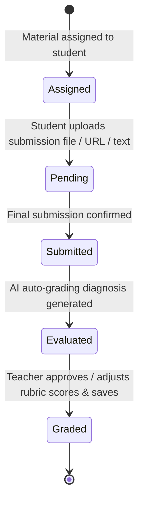

# Student Management Architecture & Submission Lifecycle

This document details the student data model, submission state machine, and grading pipeline in `frontend/src/features/students/`.

---

## 1. Submission Lifecycle & Grading Flow

---

## 2. Component Design & Scoring Invariants

1. **Criteria Breakdown Scoring (`SubmissionGradingModal.tsx`)**:
   - Calculates real-time total scores across criteria: `computedScore = sum(criteriaScores.map(c => c.score))`.
   - Compares against `material.maxScore` and computes student percentage grade `(computedScore / maxScore) * 100`.
2. **Attendance Calculation Invariant (`AttendanceManagerModal.tsx`)**:
   - Computes student attendance rate using standard weighted logic:
     $$\text{Attendance Rate} = \frac{\text{Present Count} + (0.5 \times \text{Late Count})}{\text{Total Recorded Sessions}} \times 100$$
3. **Printable Document Formatting (`ReportCardModal.tsx`)**:
   - Incorporates CSS `@media print` rules to hide navigation buttons, format high-contrast report cards, and enforce clean page breaks for multi-page exports.
