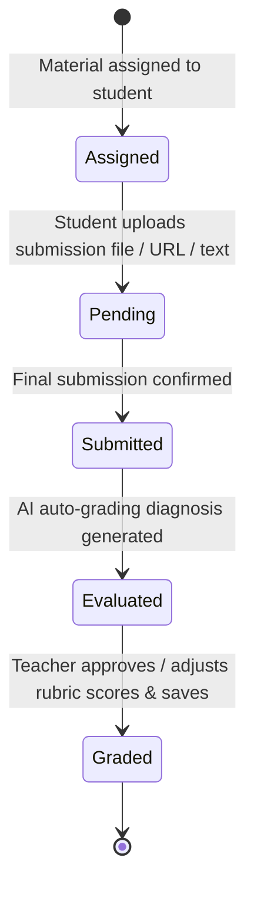
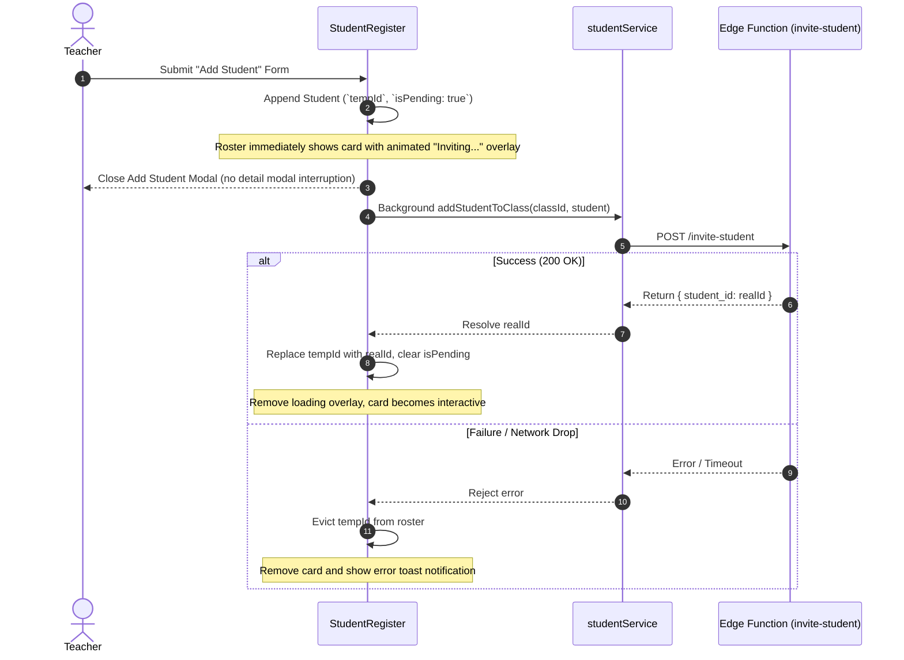

# Student Management Architecture & Submission Lifecycle

This document details the student data model, submission state machine, and grading pipeline in `frontend/src/features/students/`.

---

## 1. Submission Lifecycle & Grading Flow

---

## 2. Component Design & Scoring Invariants

1. **Criteria Breakdown Scoring (`SubmissionGradingModal.tsx`)**:
   - Calculates real-time total scores across criteria: `computedScore = sum(criteriaScores.map(c => c.score))`.
   - Compares against `material.maxScore` and computes student percentage grade `(computedScore / maxScore) * 100`.
2. **Attendance Calculation Invariant (`AttendanceManagerModal.tsx`)**:
   - Computes student attendance rate using standard weighted logic:
     $$\text{Attendance Rate} = \frac{\text{Present Count} + (0.5 \times \text{Late Count})}{\text{Total Recorded Sessions}} \times 100$$
3. **Printable Document Formatting (`ReportCardModal.tsx`)**:
   - Incorporates CSS `@media print` rules to hide navigation buttons, format high-contrast report cards, and enforce clean page breaks for multi-page exports.

---

## 3. Optimistic Roster Enrolment Lifecycle

---

## 4. Optimistic Mutations & Hybrid Upload Progress (Plan 12)

1. **Closure-Safe Concurrent Mutations (`classItemRef` in `StudentRegister.tsx`)**:
   - All background mutations (`handleAddStudent`, `handleSaveEvaluation`, `handleUpdateStudentDetails`, `handleDeleteStudent`) read and mutate `classItemRef.current`, capturing a pre-mutation snapshot (`previousClassSnapshot`) so concurrent saves never overwrite each other and automatically roll back on failure.
2. **0ms Optimistic Attendance Batch Logging (`AttendanceManagerModal.tsx`)**:
   - `handleSaveAttendance` immediately calculates updated student attendance histories and rates in memory, calls `onUpdateStudents(updatedStudents)` and `onClose()` in `0ms`, and runs `studentService.bulkLogAttendance` in the background with snapshot rollback on failure.
3. **Hybrid Submission Upload (`StudentSubmissionUploadModal.tsx`)**:
   - **Text/URL Submissions**: Dismiss the modal in `0ms`, emit a synthetic `StudentSubmission` to update the roster immediately, and persist in the background.
   - **Binary File Uploads (`file !== null`)**: Lock modal dismissal (`!isSubmitting`) and render an in-modal Blocking Progress Bar Overlay (`15% → 92% → 100%`) with formatted file size (`MB`/`KB`) and a wait warning until Supabase Storage receives the file bytes.

