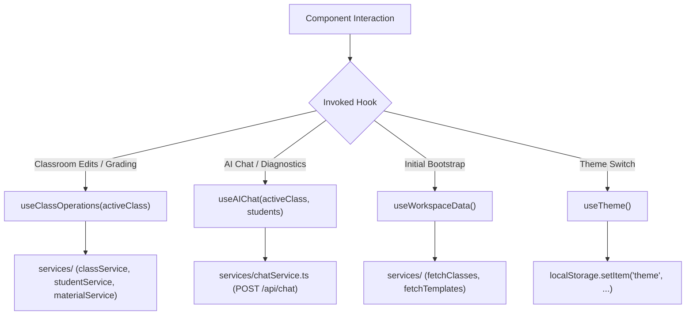

# Custom Hooks Architecture & State Orchestration

This document details the hook lifecycles, caching behaviors, and mutation pipelines in `frontend/src/hooks/`.

---

## 1. Custom Hook Architecture & Data Flow

---

## 2. Key Hook Patterns & Invariants

1. **Derived State & Closure-Safe Optimistic Mutations (`useClassOperations.ts`)**:
   - Maintains `classesRef = useRef(classes)` and `applyClassesMutation(updater)` so rapid, concurrent background promises (class renaming, archiving, material unlinking, URL material addition, and rubric/instruction add/delete) apply `0ms` optimistic UI updates and roll back cleanly on failure without stale React closure overwrites.
   - **Hybrid Material Addition (`handleAddMaterialInClass`)**:
     - **URL Materials (`!file`)**: Optimistically inserts a `temp-mat-*` (`isPending: true`) card in `0ms` without invoking the global blocking overlay, reconciling with the real DB record in the background.
     - **Binary File Materials (`file` present)**: Invokes the global `LoadingOverlay` with `showProgressBar={true}` and a formatted file-size `subMessage` (`15% → 92%` progress bar) while uploading bytes to Supabase Storage.
   - **Decoupled State Sync vs. DB Persistence (`handleUpdateClass`)**:
     - Inspects `updatedFields` for persisted `public.classes` table columns (`name`, `instituteId`, `instituteName`, `academicYear`, `semester`, `subject`, `teacherName`, `teachingStyle`, `experienceLevel`, `specialNotes`, `assessmentPreferences`, `isArchived`, `schedule`). When child collections (`students`, `materials`, `instructions`, `ragSessions`) are synchronized in local state, `handleUpdateClass` mutates `classesRef` / React state immediately without dispatching empty `UPDATE public.classes` queries.
2. **Optimistic Streaming State (`useAIChat.ts`)**:
   - Immediately adds user prompts to message history, sets `isGenerating=true`, and executes streaming token emission into the assistant response buffer before setting final parsed visualization payloads.
3. **DOM Side-Effect Synchronization (`useTheme.ts`)**:
   - Listens to OS media query changes (`prefers-color-scheme: dark`) when in `system` mode and manipulates `document.documentElement.classList` cleanly.
