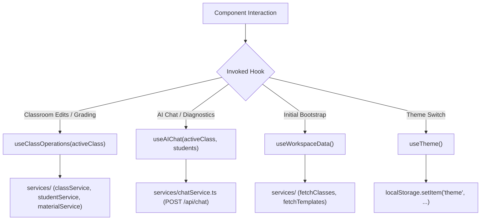

# Custom Hooks Architecture & State Orchestration

This document details the hook lifecycles, caching behaviors, and mutation pipelines in `frontend/src/hooks/`.

---

## 1. Custom Hook Architecture & Data Flow

---

## 2. Key Hook Patterns & Invariants

1. **Derived State & Single Source of Truth (`useClassOperations.ts`)**:
   - Accepts the active `ClassProject` and emits optimistic updates to local state while asynchronously persisting to Supabase via `services/`.
   - Normalizes nested entities (`materials`, `instructions`, `students`, `studentSubmissions`) into clean domain objects.
2. **Optimistic Streaming State (`useAIChat.ts`)**:
   - Immediately adds user prompts to message history, sets `isGenerating=true`, and executes streaming token emission into the assistant response buffer before setting final parsed visualization payloads.
3. **DOM Side-Effect Synchronization (`useTheme.ts`)**:
   - Listens to OS media query changes (`prefers-color-scheme: dark`) when in `system` mode and manipulates `document.documentElement.classList` cleanly.
