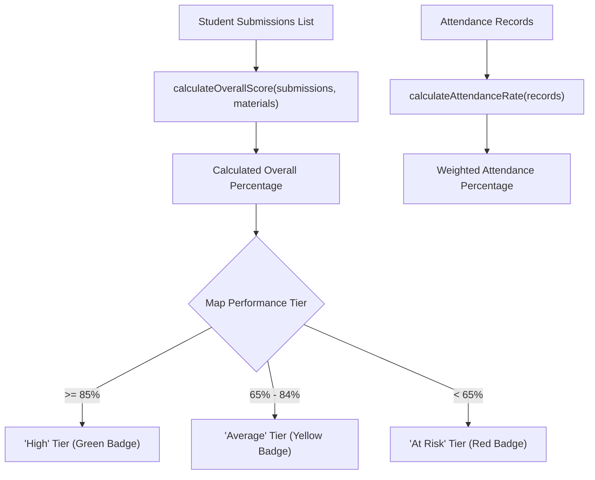

# Library Architecture & Mathematical Contracts

This document details the calculation algorithms, client initializations, and theme dictionaries implemented in `frontend/src/lib/`.

---

## 1. Domain Calculations & Score Reducers (`studentCalculations.ts`)

---

## 2. Component Design & Structural Invariants

1. **`supabase.ts` Singleton**:
   - Reads `import.meta.env.VITE_SUPABASE_URL` and `import.meta.env.VITE_SUPABASE_ANON_KEY`.
   - Binds the auto-generated database interface `Database` from `types/db.ts` to ensure type-safe query builders across all services.
2. **`themeStyles.ts` Design Dictionaries**:
   - Represents Tier 3 of the Tailwind consolidation architecture.
   - Centralizes complex multi-class strings (e.g. `CARD_BASE`, `MODAL_BACKDROP`, `BADGE_STATUS_MAP`) to prevent class drift across disparate component files.
