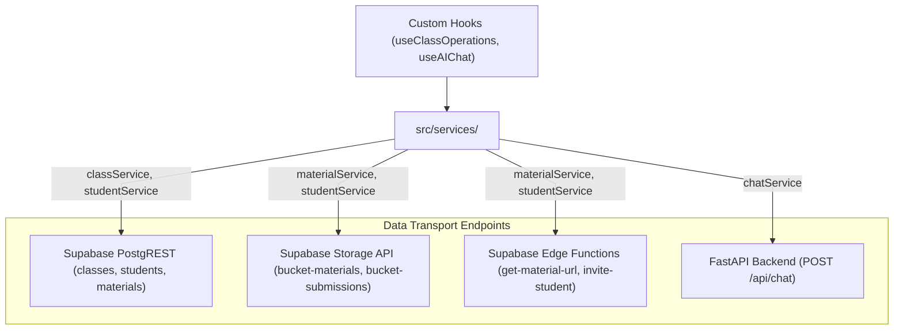

# Services Architecture & Data Access Patterns

This document details the data access patterns, PostgREST query designs, and error handling strategies implemented in `frontend/src/services/`.

---

## 1. Data Access Layer & Communication Architecture

---

## 2. Key Architecture & Error Handling Invariants

1. **Junction Table Normalization**:
   - `classService` and `templateService` handle multi-table joins (e.g. `class_materials`, `class_instructions`, `class_students`) in cohesive transactions, reconstructing flat domain objects for the UI.
2. **Defensive Storage Paths**:
   - File uploads in `materialService` follow the canonical path pattern `/{userId}/{materialId}/{contentItemId}`, matching the PostgreSQL RLS policy restrictions.
3. **FastAPI & LLM Communication (`chatService.ts`)**:
   - Dispatches requests to the FastAPI backend at `/api/chat`.
   - Propagates backend errors transparently with structured telemetry logged through `logger.ts`, surfacing actionable errors to the user via toast notifications without synthetic mock data.
