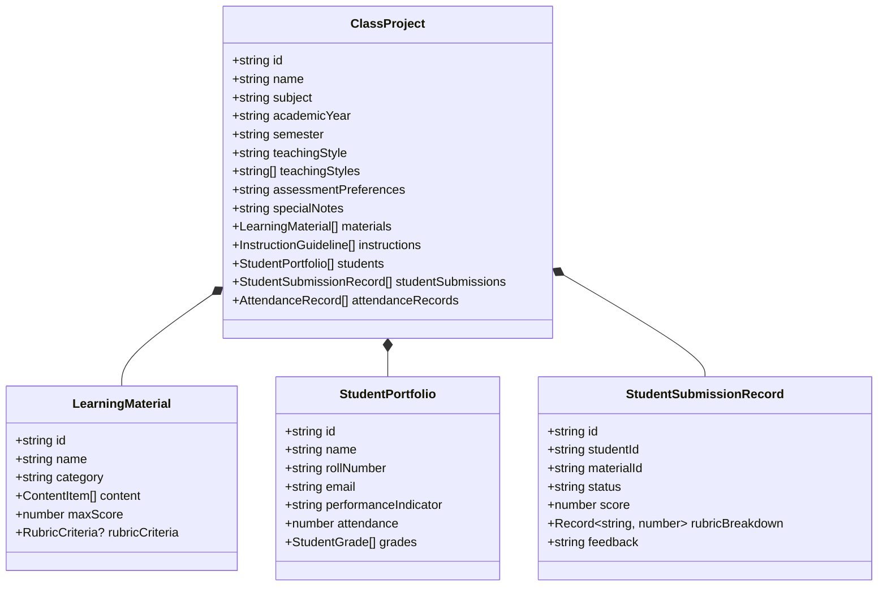

# Type Architecture & Domain Contracts

This document details the TypeScript type hierarchy, discriminated unions, and database mapping architecture in `frontend/src/types/`.

---

## 1. Domain Model Hierarchy & Composition

---

## 2. Key Type Invariants & Discrimination

1. **Discriminated View Modes (`ViewMode`)**:
   - `'details-only' | 'split' | 'chat-only'`: Statically dictates layout grid proportions in `ClassApp.tsx`.
2. **Discriminator Unions for Content (`ContentItem`)**:
   - Uses `type: 'File' | 'URL' | 'Text'` to enforce conditional properties (e.g. `path` for files vs. `url` for external links).
3. **Database Mirroring & Read-Only Invariant (`db.ts`)**:
   - Generated mechanically via `supabase gen types typescript` (`scripts/_generate_types.py`).
   - Strict mapping to PostgreSQL rows ensures compile-time errors if a database migration renames or removes a column.
   - **Manual edits are strictly prohibited** in both frontend and backend development. All custom application types must reside in separate files such as `main.ts`.
