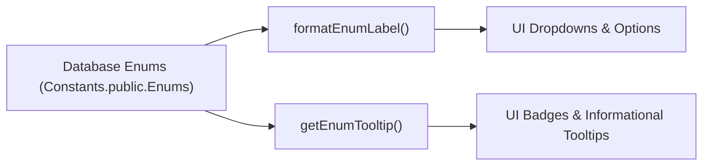

# Frontend Utilities Architecture — `frontend/src/utils/`

This document outlines the architectural role, performance characteristics, and safety guarantees of utility modules in `frontend/src/utils/`.

---

## 1. Architectural Role & Flow

## 2. Invariants & Design Principles

1. **Zero-Exception Fallbacks**: Utility functions must never throw runtime exceptions on undefined, empty, or unexpected input strings. `getEnumTooltip` and `formatEnumLabel` both return empty strings on falsy inputs.
2. **Schema Evolution Resilience**: `ENUM_TOOLTIPS` in [`enumTooltips.ts`](file:///home/victor/antigravity/Teacher-Assistant-Workspace/frontend/src/utils/enumTooltips.ts) is indexed via string keys so adding or modifying enums in PostgreSQL never causes build errors even if a tooltip is temporarily missing.
3. **Automated Tooltip Auditing**: The tooling script [`scripts/_verify_enum_tooltips.py`](file:///home/victor/antigravity/Teacher-Assistant-Workspace/scripts/_verify_enum_tooltips.py) statically audits all active database enums against `enumTooltips.ts` to detect and alert on any undocumented educational options during builds or code reviews.
