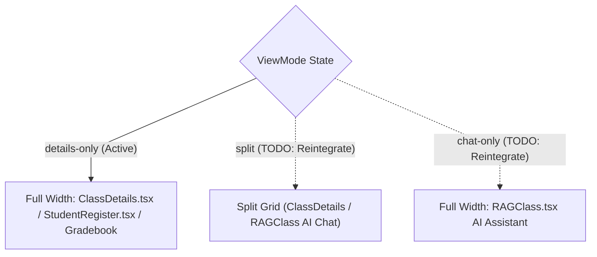

# Views Architecture & Screen Orchestration

This document details the screen transition lifecycle, view mode layout management, and event orchestration in `frontend/src/views/`.

---

## 1. `ClassApp.tsx` Master View Mode Architecture

---

## 2. Key View Patterns & State Invariants

1. **Root View Switching (`App.tsx`)**:
   - Manages top-level routing between `LandingPage`, `AuthPage`, and authenticated workspace shells.
   - For authenticated users, inspects `role` from `useAuth()`: renders `<StudentApp />` for students and `<ClassApp />` for educators.
2. **Top Navigation Controls (`ClassApp.tsx`)**:
   - Houses the master top navigation bar with interactive element IDs (`top-nav-preset-template-button`, `top-nav-view-mode-group`, `view-mode-split-button`).
   - Profile Edit/Save/Cancel controls are delegated directly inside `ClassDetails.tsx` within the **Class Profile** tab header (`class-profile-edit-button`, `class-profile-save-button`, `class-profile-cancel-button`), automatically exiting edit mode if the user switches away from the Profile tab while keeping `<StudentRegister />` visible.
3. **Toast Notifications**:
   - Centralizes notification popups (`toast-notification`, `toast-dismiss-button`) for async operations across all feature modules.
4. **Instant Submission Reflection (`StudentApp.tsx`)**:
   - On assignment turn-in (`onSubmitted(newSub)`), immediately merges `newSub` into local `submissions` state (`0ms` `"Submitted"` badge) rather than re-running the 4-query `loadClassData()` waterfall.
5. **Blocking Security & Upload Progress Bars (`ClassApp.tsx`, `AuthPage.tsx`, `StudentApp.tsx`)**:
   - `ClassApp.tsx` connects `loadingState` and `loadingSubMessage` to `<LoadingOverlay showProgressBar={true} />` for binary file uploads.
   - `AuthPage.tsx` (`ResetPasswordPage`) and `StudentApp.tsx` (`StudentPasswordModal`) render indeterminate security progress bars and lock form inputs while session tokens rotate.
