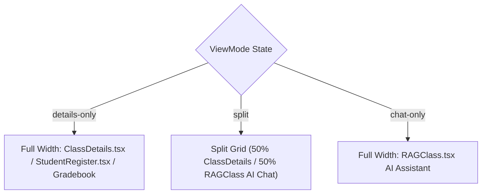

# Views Architecture & Screen Orchestration

This document details the screen transition lifecycle, view mode layout management, and event orchestration in `frontend/src/views/`.

---

## 1. `ClassApp.tsx` Master View Mode Architecture

---

## 2. Key View Patterns & State Invariants

1. **Root View Switching (`App.tsx`)**:
   - Manages top-level routing between `LandingPage`, `AuthPage`, and `ClassApp` without external router package dependencies, relying on clean state flags.
2. **Top Navigation Controls (`ClassApp.tsx`)**:
   - Houses the master top navigation bar with interactive element IDs (`top-nav-preset-template-button`, `top-nav-edit-button`, `top-nav-save-button`, `top-nav-cancel-button`, `view-mode-split-button`).
   - Manages an `isEditing` dirty-state flag that warns users or provides Save/Cancel buttons when configuring classroom parameters.
3. **Toast Notifications**:
   - Centralizes notification popups (`toast-notification`, `toast-dismiss-button`) for async operations across all feature modules.
