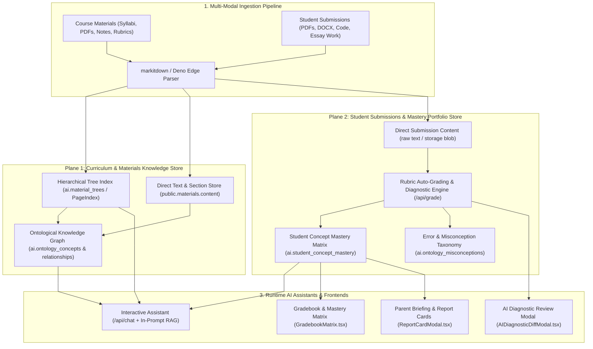
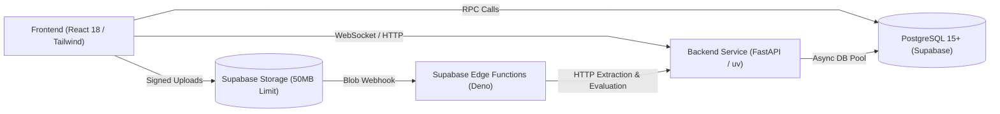

# Teach&Learn Knowledge Store Subsystem

The **Teach&Learn Knowledge Store Subsystem** is an educational knowledge compilation, indexing, and diagnostic engine designed specifically for classroom workflows. It draws architectural inspiration from **OpenKB** (compiled LLM wikis & persistent knowledge graphs), **PageIndex / RAPTOR** (hierarchical tree indexing for long educational documents), and **GraphRAG / LightRAG** (dual-level concept & prerequisite graphs), tailoring them directly to the needs of educators managing curriculum materials and student assignment submissions.

---

## 1. Executive Summary & Design Vision

Traditional RAG systems suffer from three major shortcomings in educational environments:
1. **Context Fragmentation**: Slicing a 60-page textbook chapter or syllabus into arbitrary 500-token chunks loses pedagogical hierarchy (e.g., chapter learning goals, formula derivations, and prerequisite chains).
2. **Ephemerality & Rediscovery**: Standard RAG rediscovers context from scratch on every question instead of maintaining a compounding understanding of a student's learning trajectory.
3. **Absence of Pedagogical Grounding**: Without an explicit ontology (Bloom's Taxonomy levels, concept prerequisite trees, error taxonomies), generic vector search cannot detect whether a student is missing foundational prerequisite concepts.

The **Teach&Learn Knowledge Store** bridges this gap using a **Lean Dual-Plane Knowledge Architecture** (Hierarchical Tree Index + Relational Ontological Graph, completely eliminating vector database overhead):

---

## 2. Inspiration & Comparative Analysis

| Dimension | Standard Chunk-Based RAG | OpenKB (Compiled LLM Wiki) | PageIndex / RAPTOR | **Teach&Learn Knowledge Store (Our Implementation)** |
| :--- | :--- | :--- | :--- | :--- |
| **Primary Data Structure** | Flat vector index (`vector(1536)`) | Interlinked Markdown files (`[[wikilinks]]`) | Recursive Tree of Abstracts / TOC Trees | **Lean Dual-Engine: PostgreSQL Private `ai` Schema + Hierarchical Tree JSONB + Relational Graph (Zero Vector DB Overhead)** |
| **Long Document Handling** | Fixed-size chunking with overlaps | PageIndex tree index + LLM reading | Multi-layer summarization tree | **Dual-route: Direct full-text (<20 pages) vs. Hierarchical Tree Index (≥20 pages) in `ai.material_trees`** |
| **Knowledge Evolution** | Static chunks; no cross-doc synthesis | Incremental wiki compilation on `add` | Re-clustering on corpus changes | **Trigger-based incremental compilation: `trg_material_ai_analysis` & `trg_submission_ai_eval`** |
| **Student Longitudinal Modeling** | Not supported (treats submissions as text) | Not supported (general-purpose KB) | Not supported | **Dedicated `ai.student_concept_mastery` tracking scores, confidence, and Bloom levels over time** |
| **Error & Misconception Tracking** | None | Contradiction alerts in wiki | None | **Structured pedagogical error taxonomy in `ai.ontology_misconceptions` with remediation strategies** |
| **Security & Multi-Tenancy** | Custom metadata filters | Local-first file system | In-memory / library | **Strict PostgreSQL Row Level Security (RLS) + Private `ai` schema isolated from public PostgREST API** |

---

## 3. Subsystem Architecture Map

The Knowledge Store is organized across 4 detailed design documents:

1. **[`materials_store.md`](file:///home/victor/antigravity/Teacher-Assistant-Workspace/knowledge_store/materials_store.md)**:
   - File normalization & multi-modal parsing (`markitdown` + Edge Functions).
   - Hierarchical Tree Indexing algorithm (TOC extraction $\to$ node summarization $\to$ leaf binding).
   - Ontological concept extraction and prerequisite relationship generation.
   - Direct text ingestion, token budgeting, and section breadcrumb mapping (no vector chunks).
2. **[`submissions_store.md`](file:///home/victor/antigravity/Teacher-Assistant-Workspace/knowledge_store/submissions_store.md)**:
   - Student work ingestion from `student-submissions` storage bucket.
   - Autonomous rubric auto-grading pipeline and structured JSON scoring contracts.
   - Error detection matching against `ai.ontology_misconceptions`.
   - Longitudinal student concept mastery updates and gradebook synchronization.
3. **[`retrieval_and_rag.md`](file:///home/victor/antigravity/Teacher-Assistant-Workspace/knowledge_store/retrieval_and_rag.md)**:
   - Dual-Engine Retrieval Algorithm (Reasoning-based tree traversal + Recursive graph expansion).
   - Context packaging and token density optimizations for `/api/chat`.
   - Interactive visualizer widget generation (heatmaps, distributions, rankings).
4. **[`implementation_roadmap.md`](file:///home/victor/antigravity/Teacher-Assistant-Workspace/knowledge_store/implementation_roadmap.md)**:
   - Incremental execution phases for tree indexing, graph ontology, and prompt assembly.
   - Database schema DDL additions and SQL trigger definitions.
   - Backend FastAPI endpoints and Deno Edge Function implementations.

---

## 4. Integration with Existing Teach&Learn Systems

The Knowledge Store seamlessly integrates with the existing system architecture:

- **Database & Storage Subsystem** ([`systems/database_and_storage.md`](file:///home/victor/antigravity/Teacher-Assistant-Workspace/systems/database_and_storage.md)): Stores raw entities in `public`, hierarchical trees and knowledge graphs in `ai`, and checkpoints in `langgraph`.
- **AI & Ontology Subsystem** ([`systems/ai_and_ontology_subsystem.md`](file:///home/victor/antigravity/Teacher-Assistant-Workspace/systems/ai_and_ontology_subsystem.md)): Houses the evaluation engines and prompt serialization logic.
- **Backend Service Subsystem** ([`systems/backend_service.md`](file:///home/victor/antigravity/Teacher-Assistant-Workspace/systems/backend_service.md)): Exposes `/api/chat`, `/api/grade`, and `/api/materials/analyze`.
- **Edge Functions Subsystem** ([`systems/edge_functions.md`](file:///home/victor/antigravity/Teacher-Assistant-Workspace/systems/edge_functions.md)): Manages file parsing, signed URLs, and async webhook relays.
