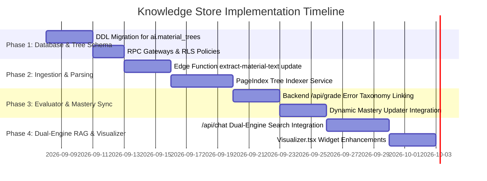

# Knowledge Store Implementation Roadmap & Verification Plan

This document details the step-by-step engineering roadmap to implement, migrate, and verify the **Teach&Learn Knowledge Store Subsystem** across the database, edge functions, backend services, and frontend interfaces.

---

## 1. Phased Implementation Roadmap

---

## 2. Detailed Phase Breakdown

### Phase 1: Database DDL & Schema Enhancements (`schema/schema-ai.sql`)
- [ ] Add `ai.material_trees` table with recursive JSONB node definitions and B-Tree indexes.
- [ ] Update `ai.student_concept_mastery` trigger routines for exponential moving average updates.
- [ ] Verify recursive CTE query performance for prerequisite graph traversal on `ai.ontology_relationships`.
- [ ] Implement secure public RPC gateways:
  - `get_material_tree(p_material_id UUID)`
  - `get_student_concept_mastery_matrix(p_class_id UUID)`
  - `get_concept_prerequisite_tree(p_concept_id UUID)`

### Phase 2: Ingestion, Normalization & Tree Indexing
- [ ] Enhance Deno Edge Function `extract-material-text` with `markitdown` text normalization.
- [ ] Implement backend Python service module `src/service/tree_indexer.py`:
  - Parses Markdown headers into hierarchical $N$-ary tree.
  - Generates recursive summary abstracts for chapters and sections.
  - Persists JSONB tree to `ai.material_trees`.
- [ ] Connect database trigger `trg_material_ai_analysis` to invoke tree compilation on new material uploads.

### Phase 3: Autonomous Rubric Evaluator & Error Taxonomy
- [ ] Update `EvaluatorService.grade_submission()` to query `ai.ontology_misconceptions`.
- [ ] Implement automated misconception tagging in `GradeResponse.private_teacher_notes`.
- [ ] Update `ai.student_concept_mastery` records upon teacher approval in `AIDiagnosticDiffModal.tsx`.
- [ ] Synchronize running class GPA and performance tiers in `public.class_students`.

### Phase 4: Dual-Engine Pedagogical Assistant & Frontend Widgets
- [ ] Refactor `ChatService` to coordinate dual-engine retrieval (Tree Traversal + Recursive Graph Expansion + Scoped Context Injection).
- [ ] Implement deterministic prompt context budget allocator (~4,300 token ceiling).
- [ ] Upgrade `Visualizer.tsx` in frontend to render interactive concept mastery heatmaps and student gap leaderboards.
- [ ] Implement SSE (Server-Sent Events) streaming for real-time token-by-token chat responses.

---

## 3. Verification & Testing Protocol

### 3.1 Automated Tests
1. **Schema Integrity & RLS Verification**:
   - Run SQL test suite ensuring non-admin roles cannot read or write directly to the `ai` schema.
   - Test security definer RPC gateways with valid and invalid JWT tokens.
2. **Backend Unit & Integration Tests**:
   - `pytest tests/test_evaluator.py`: Verify rubric scoring mathematical invariants (scores never exceed `max_score`).
   - `pytest tests/test_tree_indexer.py`: Test hierarchical tree generation on 50+ page mock syllabus PDFs.
   - `pytest tests/test_chat_rag.py`: Validate structured JSON parser, context budgeting, and visualization payload schema conformance.
3. **Frontend Component & Typecheck**:
   - `npm run build`: Strict TypeScript verification with zero `any` types.
   - Verify modal interactions in `AIDiagnosticDiffModal.tsx` and `MaterialPreviewModal.tsx`.

### 3.2 Manual Verification Scenarios
- **Scenario A: Syllabus Ingestion & Tree Navigation**:
  - Teacher uploads a 30-page Calculus textbook PDF.
  - Verify `ai.material_trees` contains generated chapter summaries.
  - Ask assistant: *"What prerequisites are needed for Chapter 4?"* — verify assistant uses tree traversal and answers with precise citations.
- **Scenario B: Student Submission Auto-Grading & Diagnostic Diff**:
  - Student uploads a physics lab report with an intentional sign error.
  - Verify evaluator triggers, computes criterion scores, and identifies the matched misconception in `ai.ontology_misconceptions`.
  - Teacher opens `AIDiagnosticDiffModal.tsx`, adjusts criteria sliders, and saves to database.
  - Verify `class_students` recomputes GPA and `ai.student_concept_mastery` reflects updated mastery status.
