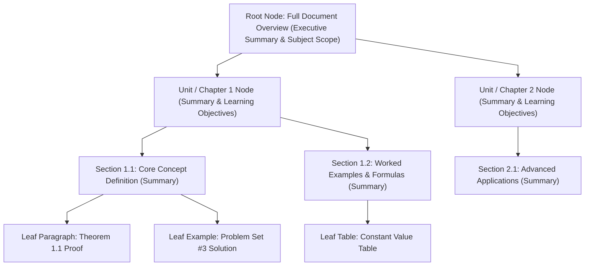
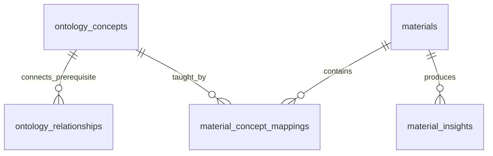

# Curriculum & Materials Knowledge Store

The **Curriculum & Materials Knowledge Store** is the repository and compilation engine for all educational resources in Teach&Learn, including syllabi, textbooks, lecture slides, assignment briefs, and rubric definitions.

---

## 1. Architectural Blueprint & Ingestion Flow

```mermaid
%%{init: {'flowchart': {'curve': 'linear'}}}%%
flowchart TD
    subgraph UploadTrigger["1. Upload & Trigger"]
        Teacher["Teacher Client"] -->|Upload File (PDF, DOCX, PPTX, MD)| Bucket["Storage Bucket: class-materials"]
        Bucket -->|INSERT Trigger| DBTrigger["DB Trigger: trg_material_ai_analysis"]
        DBTrigger -->|pg_net POST| EdgeFn["Edge Function: trigger-material-analysis"]
    end

    subgraph Normalization["2. Multi-Modal Parsing & Routing"]
        EdgeFn -->|Download Blob| DocParser["Text & Structure Parser (markitdown / pdfjs)"]
        DocParser --> PageCheck{"Page Count ≥ 20?"}
    end

    subgraph IndexingRoutes["3. Multi-Tier Routing & Storage Engine"]
        PageCheck -->|Yes: Long Document| TreeBuilder["PageIndex Tree Indexing Engine"]
        PageCheck -->|No: Standard Document| DirectStorage["Direct Full-Text & Markdown Storage (public.materials.content)"]
        
        TreeBuilder -->|Hierarchical JSONB Structure| MatTreeTable[("ai.material_trees")]
        DirectStorage -->|Direct Context Ready| PublicMatTable[("public.materials")]
    end

    subgraph OntologicalSynthesis["4. Ontological Compilation Phase"]
        DocParser --> LLMCompiler["LLM Knowledge Compiler (Backend Service)"]
        LLMCompiler -->|Extract Concepts & Bloom Levels| ConceptsTable[("ai.ontology_concepts")]
        LLMCompiler -->|Map Prerequisite Edges| RelTable[("ai.ontology_relationships")]
        LLMCompiler -->|Map Sections & Excerpts to Concepts| MapTable[("ai.material_concept_mappings")]
        LLMCompiler -->|Pedagogical Insights & Gaps| InsightsTable[("ai.material_insights")]
    end
```

---

## 2. Ingestion & Multi-Modal Normalization

1. **Storage Bucket Organization**:
   Files reside in the private bucket `class-materials` under structured paths:
   `/{teacher_user_id}/{material_id}/{content_item_id}.{ext}`
2. **Supported Formats**:
   - **Textual & Presentation**: `.pdf`, `.docx`, `.pptx`, `.txt`, `.md`.
   - **Tabular & Data**: `.csv`, `.xlsx`.
   - **Visuals**: `.png`, `.jpg` (processed via Vision LLM / OCR in PageIndex Cloud when configured).
3. **Markdown Normalization via `markitdown`**:
   The parser cleans and normalizes all input formats into standardized Markdown, converting embedded tables to Markdown tables and preserving header structures (`#`, `##`, `###`).

---

## 3. Hierarchical Tree Indexing Algorithm (PageIndex & RAPTOR Inspiration)

For complex multi-page educational materials (e.g., textbook chapters, detailed curriculum frameworks, or 40+ slide decks), traditional fixed-size chunking destroys hierarchical context. The Materials Store employs a **Hierarchical Tree Index**:



### Database Schema for Tree Storage (`ai.material_trees`):
```sql
CREATE TABLE IF NOT EXISTS ai.material_trees (
    id UUID PRIMARY KEY DEFAULT gen_random_uuid(),
    material_id UUID NOT NULL REFERENCES public.materials(id) ON DELETE CASCADE,
    root_node JSONB NOT NULL, -- Recursive Tree: { id, title, level, summary, page_start, page_end, children: [...], leaf_chunk_ids: [...] }
    total_nodes INTEGER NOT NULL,
    max_depth INTEGER NOT NULL,
    created_at TIMESTAMPTZ NOT NULL DEFAULT timezone('utc'::text, now()),
    CONSTRAINT unique_material_tree UNIQUE (material_id)
);

CREATE INDEX IF NOT EXISTS idx_ai_mat_trees_material_id ON ai.material_trees(material_id);
```

### Tree Indexing Construction Algorithm:
1. **Structural Segmentation**: Extract document hierarchy using heading tags and table of contents.
2. **Bottom-Up Summarization**:
   - For every leaf chunk (200-400 tokens), create a node reference.
   - For every parent section, aggregate child summaries and synthesize a section-level learning abstract.
   - For the document root, produce an executive pedagogical syllabus map.
3. **Agent Traversal Index**: The resulting tree enables the AI Assistant to locate target information via top-down reasoning:
   $$\text{Doc Root} \xrightarrow{\text{Filter by Unit}} \text{Unit Summary} \xrightarrow{\text{Filter by Section}} \text{Target Paragraph Chunk}$$

---

## 4. Direct Context Ingestion & Lightweight Full-Text Search (FTS)

Standard educational materials in Teach&Learn (such as 2- to 15-page syllabi, assignment prompts, and lab handouts) average 1,500 to 8,000 tokens. Modern frontier models (Gemini 2.5 Flash / Claude 3.5 Sonnet) operate with **200k to 1M+ token context windows**, rendering 500-token vector chunking obsolete for standard classroom documents:

1. **Context Integrity**: By bypassing chunk slicing, the model sees the entire document structure, complete rubric criteria tables, and grading policies with zero boundary loss.
2. **Zero Overhead**: Eliminates external embedding API calls, rate limits, 1536-dimensional float storage, and `pgvector` memory consumption.
3. **Optional Native Full-Text Search (FTS)**: For keyword filtering across large historical material archives, PostgreSQL's native `tsvector` provides instant, indexed keyword search without requiring vector extensions:

```sql
-- Optional: Lightweight Native Keyword Search (Zero Vector DB Overhead)
ALTER TABLE public.materials 
ADD COLUMN IF NOT EXISTS fts_tokens tsvector 
GENERATED ALWAYS AS (to_tsvector('english', coalesce(name, '') || ' ' || coalesce(category, ''))) STORED;

CREATE INDEX IF NOT EXISTS idx_materials_fts ON public.materials USING gin(fts_tokens);
```

---

## 5. Ontological Knowledge Graph Construction (Curriculum Graph)

When material is compiled, the backend automatically extracts curriculum concepts, Bloom's Taxonomy levels, and prerequisite relationships:



1. **`ai.ontology_concepts`**:
   - Represents subject learning objectives (`subject`, `code`, `name`, `description`, `bloom_level`, `parent_concept_id`).
   - `bloom_level` ∈ `{'Remember', 'Understand', 'Apply', 'Analyze', 'Evaluate', 'Create'}`.
2. **`ai.ontology_relationships`**:
   - Directed knowledge edges (`source_concept_id`, `target_concept_id`, `relationship_type`, `weight`).
   - Types: `'prerequisite_of'`, `'subconcept_of'`, `'reinforces'`, `'related_to'`.
3. **`ai.material_concept_mappings`**:
   - Explicit bridge linking materials and hierarchical sections to ontological concepts with a confidence score and evidence excerpt:
   ```sql
   CREATE TABLE IF NOT EXISTS ai.material_concept_mappings (
       id UUID PRIMARY KEY DEFAULT gen_random_uuid(),
       material_id UUID NOT NULL REFERENCES public.materials(id) ON DELETE CASCADE,
       concept_id UUID NOT NULL REFERENCES ai.ontology_concepts(id) ON DELETE CASCADE,
       section_path TEXT,                            -- e.g. 'Unit 2 > Section 2.1' or tree node ID
       relationship TEXT NOT NULL DEFAULT 'teaches', -- 'teaches', 'assesses', 'prerequisite_for'
       relevance_score NUMERIC DEFAULT 1.0,
       evidence_excerpt TEXT,
       created_at TIMESTAMPTZ NOT NULL DEFAULT timezone('utc'::text, now())
   );
   ```
4. **`ai.material_insights`**:
   - Stores automated syllabus alignment scores, detected prerequisite knowledge gaps, and generated multi-choice practice questions.

