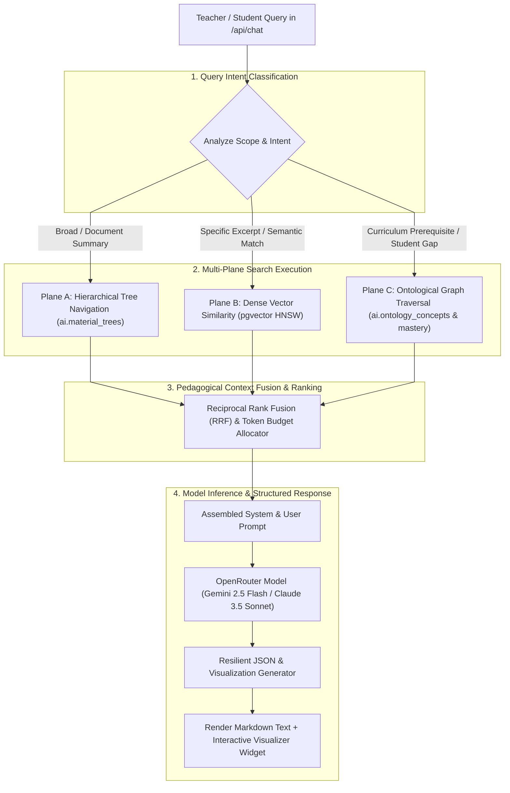

# Unified Retrieval, Reasoning & RAG Engine

The **Unified Retrieval, Reasoning & RAG Engine** coordinates multi-modal search, hierarchical tree traversal, ontological graph expansion, and prompt context packaging across the Teach&Learn platform.

---

## 1. Multi-Plane Hybrid Retrieval Architecture

To answer diverse pedagogical queries (ranging from specific formula lookups to multi-student longitudinal gap analyses), the retrieval engine executes a **Three-Plane Hybrid Search Strategy**:



---

## 2. Retrieval Algorithms in Detail

### Algorithm 1: Hierarchical Tree Navigation (PageIndex-Style)
Used when querying long educational documents (e.g. textbooks, comprehensive syllabi):
1. **Root Query Match**: Check query keywords and intent against the root syllabus summary in `ai.material_trees`.
2. **Branch Pruning**: Identify top-2 most relevant chapters/units and exclude unrelated branches.
3. **Section Traversal**: Reason through the sub-tree nodes to find the exact target sections and extract the associated leaf chunks.
4. **Benefit**: Avoids pulling 30 fragmented vector chunks and guarantees that surrounding context and heading paths are preserved.

---

### Algorithm 2: Dense Semantic Vector Search (`pgvector`)
Used for targeted semantic searches across materials and student submissions:
```sql
-- Semantic Search against Material Chunks
SELECT 
    m.name AS material_name,
    me.chunk_index,
    me.chunk_content,
    1 - (me.embedding <=> p_query_embedding) AS similarity_score
FROM ai.material_embeddings me
JOIN public.materials m ON m.id = me.material_id
JOIN public.class_materials cm ON cm.material_id = m.id
WHERE cm.class_id = p_class_id
ORDER BY me.embedding <=> p_query_embedding ASC
LIMIT p_top_k;
```

---

### Algorithm 3: Ontological Graph Expansion (GraphRAG-Style)
Used for pedagogical gap analyses, prerequisite checks, and mastery questions:
```sql
-- Fetch Missing Prerequisites for a Target Concept
WITH RECURSIVE prerequisite_chain AS (
    SELECT 
        c.id, c.name, c.bloom_level, r.relationship_type, 1 AS depth
    FROM ai.ontology_concepts c
    JOIN ai.ontology_relationships r ON r.source_concept_id = c.id
    WHERE r.target_concept_id = p_target_concept_id AND r.relationship_type = 'prerequisite_of'
    
    UNION ALL
    
    SELECT 
        c.id, c.name, c.bloom_level, r.relationship_type, pc.depth + 1
    FROM ai.ontology_concepts c
    JOIN ai.ontology_relationships r ON r.source_concept_id = c.id
    JOIN prerequisite_chain pc ON pc.id = r.target_concept_id
    WHERE r.relationship_type = 'prerequisite_of' AND pc.depth < 3
)
SELECT * FROM prerequisite_chain;
```

---

## 3. Reciprocal Rank Fusion (RRF) & Context Assembly

When multiple retrieval planes are active, results are combined using Reciprocal Rank Fusion:
$$RRF(d) = \sum_{m \in M} \frac{1}{k + r_m(d)}$$
where $k = 60$, $M = \{\text{Tree}, \text{Vector}, \text{Graph}\}$, and $r_m(d)$ is the rank of document $d$ in search plane $m$.

### Prompt Context Budgeting:
The assembled prompt enforces a strict token budget to guarantee low latency and zero context truncation:
- **System Instructions & Teacher Persona**: ~500 tokens.
- **Classroom Profile & Active Directives**: ~300 tokens.
- **Retrieved Curriculum Excerpts (Tree + Vector)**: ~2,500 tokens.
- **Student Mastery & Performance Statistics**: ~1,200 tokens.
- **Conversation History (Last 5 Turns)**: ~1,500 tokens.

---

## 4. Interactive Visualization Generator

The RAG Assistant generates structured interactive UI widgets alongside markdown text, rendered by `Visualizer.tsx`:

```json
{
  "text": "### Unit 3 Mastery Overview\nMost students have mastered Linear Equations, but 35% exhibit a gap in **Quadratic Factoring by Grouping**.",
  "visualization": {
    "type": "heatmap",
    "title": "Classroom Concept Mastery Heatmap",
    "description": "Student performance across Unit 3 learning standards",
    "data": [
      {
        "studentName": "Alex Johnson",
        "concepts": [
          {"name": "Linear Equations", "score": 95, "status": "Mastered"},
          {"name": "Factoring by Grouping", "score": 58, "status": "Gap Detected"}
        ]
      },
      {
        "studentName": "Beatrice Smith",
        "concepts": [
          {"name": "Linear Equations", "score": 88, "status": "Mastered"},
          {"name": "Factoring by Grouping", "score": 84, "status": "Practicing"}
        ]
      }
    ]
  }
}
```

### Supported Widget Types:
1. **`charts`**: Score distribution bar charts, class averages vs. student score comparisons.
2. **`heatmap`**: Multi-student concept mastery matrix.
3. **`ranking`**: Leaderboards, highest improving students, and students needing critical intervention.
4. **`timeline`**: Longitudinal assignment score trends across the semester.
5. **`stats`**: Summary KPI cards (class average GPA, attendance rate, submission completion percentage).
