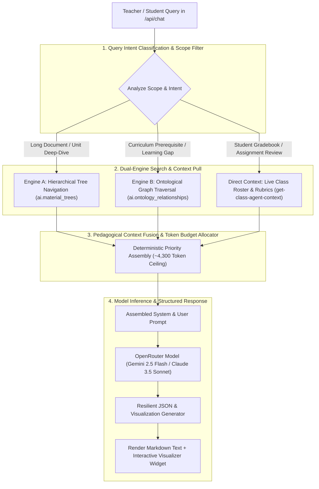

# Unified Retrieval, Reasoning & RAG Engine

The **Unified Retrieval, Reasoning & RAG Engine** coordinates multi-modal search, hierarchical tree traversal, ontological graph expansion, and prompt context packaging across the Teach&Learn platform.

---

## 1. Dual-Engine Pedagogical Retrieval & Context Assembly

To answer diverse pedagogical queries (ranging from specific textbook unit breakdowns to multi-student longitudinal gap analyses), the retrieval engine executes a **Dual-Engine Search & Context Strategy** that completely bypasses vector database latency and token bloat:



---

## 2. Retrieval Algorithms in Detail

### Algorithm 1: Hierarchical Tree Navigation (PageIndex-Style)
Used when querying long educational documents (e.g. 50+ page textbooks, comprehensive state syllabi):
1. **Root Query Match**: Match query keywords and intent against the root syllabus summary in `ai.material_trees`.
2. **Branch Pruning**: Prune unrelated chapters/units and identify the top target sections.
3. **Section Extraction**: Navigate the sub-tree directly to the exact target section and extract the leaf paragraph (~300–500 tokens).
4. **Token Advantage**: Injects only the precise 300–500 token subsection with parent breadcrumbs, rather than 5,000 tokens of noisy vector chunks or 50,000 tokens of raw PDF text.

---

### Algorithm 2: Ontological Graph Expansion (GraphRAG-Style)
Used for pedagogical gap analyses, prerequisite checks, and mastery questions:
```sql
-- Fetch Missing Prerequisites for a Target Concept (Native SQL Graph Traversal)
WITH RECURSIVE prerequisite_chain AS (
    SELECT 
        c.id, c.name, c.bloom_level, r.relationship_type, 1 AS depth
    FROM ai.ontology_concepts c
    JOIN ai.ontology_relationships r ON r.source_concept_id = c.id
    WHERE r.target_concept_id = p_target_concept_id AND r.relationship_type = 'prerequisite_of'
    
    UNION ALL
    
    SELECT 
        c.id, c.name, c.bloom_level, r.relationship_type, pc.depth + 1
    FROM ai.ontology_concepts c
    JOIN ai.ontology_relationships r ON r.source_concept_id = c.id
    JOIN prerequisite_chain pc ON pc.id = r.target_concept_id
    WHERE r.relationship_type = 'prerequisite_of' AND pc.depth < 3
)
SELECT * FROM prerequisite_chain;
```

---

### Algorithm 3: Relational SQL Aggregation for Class & Student Diagnostics
Rather than dumping raw student submissions into prompt context, PostgreSQL pre-aggregates diagnostic statistics directly inside the database via public RPC gateways:
- `get_class_concept_matrix(p_class_id)`: Calculates average mastery percentages, counts students with gaps, and groups by Bloom level in SQL.
- `get_student_concept_gaps(p_class_id, p_student_id)`: Traverses student evaluation records and attaches targeted remediation strategies from `ai.ontology_misconceptions`.
- **Token Advantage**: Delivers compact JSON diagnostic summaries (~250–400 tokens) instead of tens of thousands of raw submission tokens.

---

## 3. Pedagogical Context Assembly & Token Budgeting

Rather than fuzzy reciprocal ranking across random chunks, context is fused using a deterministic priority hierarchy:

1. **Active Directives & Teacher Profile** (Highest Priority)
2. **Targeted Material / Tree Leaf Excerpt** (Scoped by active assignment or tree navigation)
3. **Pre-Aggregated Student / Class Diagnostic Metrics** (From PostgreSQL RPCs)
4. **Recent Conversation Turns** (Sliding window of last 4–5 turns)

### Prompt Context Budget Allocation:
The assembled prompt enforces a strict token budget to guarantee rapid inference, zero context truncation, and minimal operational costs:
- **System Instructions & Teacher Persona**: ~500 tokens.
- **Classroom Profile & Active Directives**: ~300 tokens.
- **Retrieved Curriculum Excerpt (Tree Leaf / Section)**: ~1,500 tokens.
- **Pre-Aggregated Student Mastery Statistics**: ~800 tokens.
- **Conversation History (Last 5 Turns)**: ~1,200 tokens.
- **Total Prompt Ceiling**: **~4,300 tokens** (leaving ample headroom for structured JSON response generation).

---

## 4. Interactive Visualization Generator

The RAG Assistant generates structured interactive UI widgets alongside markdown text, rendered by `Visualizer.tsx`:

```json
{
  "text": "### Unit 3 Mastery Overview\nMost students have mastered Linear Equations, but 35% exhibit a gap in **Quadratic Factoring by Grouping**.",
  "visualization": {
    "type": "heatmap",
    "title": "Classroom Concept Mastery Heatmap",
    "description": "Student performance across Unit 3 learning standards",
    "data": [
      {
        "studentName": "Alex Johnson",
        "concepts": [
          {"name": "Linear Equations", "score": 95, "status": "Mastered"},
          {"name": "Factoring by Grouping", "score": 58, "status": "Gap Detected"}
        ]
      },
      {
        "studentName": "Beatrice Smith",
        "concepts": [
          {"name": "Linear Equations", "score": 88, "status": "Mastered"},
          {"name": "Factoring by Grouping", "score": 84, "status": "Practicing"}
        ]
      }
    ]
  }
}
```

### Supported Widget Types:
1. **`charts`**: Score distribution bar charts, class averages vs. student score comparisons.
2. **`heatmap`**: Multi-student concept mastery matrix.
3. **`ranking`**: Leaderboards, highest improving students, and students needing critical intervention.
4. **`timeline`**: Longitudinal assignment score trends across the semester.
5. **`stats`**: Summary KPI cards (class average GPA, attendance rate, submission completion percentage).
