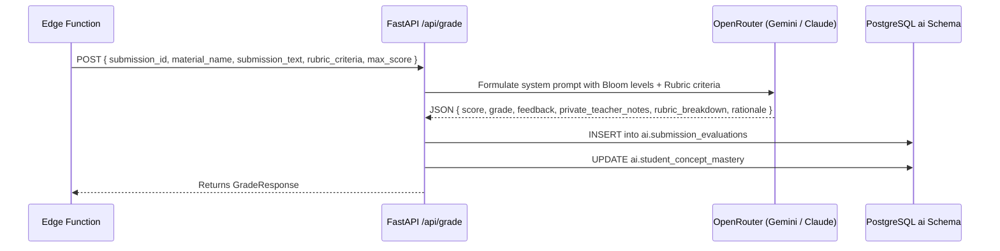
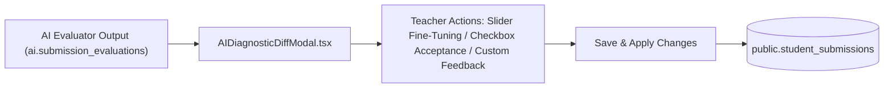

# Student Submissions & Mastery Portfolio Store

The **Student Submissions & Mastery Portfolio Store** manages the ingestion, indexing, automated rubric evaluation, diagnostic diff workflows, error taxonomy tracking, and longitudinal concept mastery matrices for student work.

---

## 1. Architectural Blueprint & Ingestion Pipeline

```mermaid
%%{init: {'flowchart': {'curve': 'linear'}}}%%
flowchart TD
    subgraph SubmissionIntake["1. Student Submission Intake"]
        Student["Student / Teacher Client"] -->|Upload Work (PDF, Code, Text)| SubBucket["Storage: student-submissions"]
        SubBucket -->|INSERT / UPDATE status='Submitted'| SubTrigger["DB Trigger: trg_submission_ai_eval"]
        SubTrigger -->|pg_net POST| EdgeFnSub["Edge Function: trigger-submission-evaluation"]
    end

    subgraph ExtractionEval["2. Extraction & Auto-Grading"]
        EdgeFnSub -->|Download & Parse Text| Extractor["Text Extractor (extract-material-text)"]
        Extractor --> EvalPayload["Assemble Grading Request Payload"]
        EvalPayload --> BackendGrade["Backend POST /api/grade (EvaluatorService)"]
        BackendGrade --> RubricEval["LLM Multi-Criterion Rubric Scoring & Rationale"]
    end

    subgraph ErrorAndMastery["3. Pedagogical Misconception & Mastery Linking"]
        RubricEval --> MisconceptionMatcher["Misconception Matcher (ai.ontology_misconceptions)"]
        RubricEval --> MasteryUpdater["Concept Mastery Matrix Updater (ai.student_concept_mastery)"]
        RubricEval --> SubEvalRecord[("ai.submission_evaluations")]
        RubricEval --> SubVectorStore[("ai.submission_embeddings")]
    end

    subgraph TeacherReview["4. Teacher Review & Gradebook Sync"]
        SubEvalRecord --> DiffUI["AI Diagnostic Review Modal (AIDiagnosticDiffModal.tsx)"]
        DiffUI -->|Accept / Tweak Sliders / Save| PublicSub[("public.student_submissions")]
        PublicSub -->|Trigger trg_sync_student_scores| ClassStudents[("public.class_students (GPA, Tier, Grade)")]
    end
```

---

## 2. Ingestion & Storage Organization

1. **Storage Bucket**:
   Student files are stored in the private bucket `student-submissions` under path:
   `/{material_id}/{content_item_id}.{ext}`
2. **Multi-Format Ingestion**:
   - Written assignments & essays (`.pdf`, `.docx`, `.txt`, `.md`).
   - Source code submissions (`.py`, `.ts`, `.js`, `.java`, `.cpp`).
   - Digital image uploads of handwritten work (`.png`, `.jpg`).

---

## 3. Autonomous Rubric Evaluation Engine (`/api/grade`)

When a submission is evaluated, the backend `EvaluatorService` compares the student's work against the material's configured `rubric_criteria` and the class instructional profile:

### Evaluator Sequence:


### JSON Response Schema (`GradeResponse`):
```json
{
  "submission_id": "8f1a4e21-5c3b-4a78-9e2d-1a8c4b6e9f02",
  "score": 45.0,
  "max_score": 50.0,
  "grade": "A (90%)",
  "feedback": "Excellent demonstration of algebraic factoring. Steps are clearly documented with accurate signs.",
  "private_teacher_notes": "Student excelled at grouping terms. Minor arithmetic hesitation in Step 4.",
  "rubric_breakdown": [
    {
      "criterionId": "crit-math-1",
      "criterionName": "Conceptual Method",
      "score": 23.0,
      "maxScore": 25.0,
      "comment": "Correctly selected the AC factoring method."
    },
    {
      "criterionId": "crit-math-2",
      "criterionName": "Execution & Accuracy",
      "score": 22.0,
      "maxScore": 25.0,
      "comment": "Accurate factorization with clear step-by-step proof."
    }
  ],
  "rationale": "High mastery across all standard criteria.",
  "status": "completed",
  "model_used": "google/gemini-2.5-flash"
}
```

---

## 4. Misconception & Error Taxonomy (`ai.ontology_misconceptions`)

To prevent generic feedback, the Knowledge Store matches student errors against a formal pedagogical misconception taxonomy:

```sql
CREATE TABLE IF NOT EXISTS ai.ontology_misconceptions (
    id UUID PRIMARY KEY DEFAULT gen_random_uuid(),
    concept_id UUID NOT NULL REFERENCES ai.ontology_concepts(id) ON DELETE CASCADE,
    error_pattern TEXT NOT NULL,          -- e.g. 'Treats (a+b)^2 as a^2 + b^2 (Freshman's Dream)'
    remediation_strategy TEXT NOT NULL,   -- e.g. 'Guide with geometric 2x2 area model'
    severity TEXT DEFAULT 'Moderate',     -- 'Minor', 'Moderate', 'Critical'
    created_at TIMESTAMPTZ NOT NULL DEFAULT timezone('utc'::text, now())
);
```

When the evaluator detects an error matching `error_pattern`, it automatically attaches the corresponding `remediation_strategy` to the private teacher notes and student feedback.

---

## 5. Longitudinal Student Concept Mastery Matrix (`ai.student_concept_mastery`)

Rather than treating grades as isolated numbers, student proficiency is tracked at the **granular concept level**:

```sql
CREATE TABLE IF NOT EXISTS ai.student_concept_mastery (
    id UUID PRIMARY KEY DEFAULT gen_random_uuid(),
    student_id UUID NOT NULL REFERENCES public.students(id) ON DELETE CASCADE,
    class_id UUID NOT NULL REFERENCES public.classes(id) ON DELETE CASCADE,
    concept_id UUID NOT NULL REFERENCES ai.ontology_concepts(id) ON DELETE CASCADE,
    mastery_score NUMERIC NOT NULL DEFAULT 0.0, -- Normalized score (0.00 to 1.00)
    confidence NUMERIC NOT NULL DEFAULT 0.5,    -- Statistical confidence based on sample count
    status TEXT NOT NULL DEFAULT 'practicing',  -- 'mastered' (>=0.85), 'practicing' (0.65-0.84), 'gap_detected' (<0.65)
    evidence_submission_ids UUID[] DEFAULT '{}'::uuid[],
    last_evaluated_at TIMESTAMPTZ NOT NULL DEFAULT timezone('utc'::text, now()),
    CONSTRAINT unique_student_class_concept UNIQUE (student_id, class_id, concept_id)
);

CREATE INDEX IF NOT EXISTS idx_ai_mastery_student_class 
ON ai.student_concept_mastery(student_id, class_id);
```

### Dynamic Mastery Calculation Formula:
When a new submission $s_k$ is graded with score $M_{s_k}$ on concept $C$:
$$\text{Mastery}_{new} = \alpha \cdot M_{s_k} + (1 - \alpha) \cdot \text{Mastery}_{prev}$$
where $\alpha = 0.35$ (recency-weighted exponential moving average).

---

## 6. Teacher AI Diagnostic Diff Review Workflow (`AIDiagnosticDiffModal.tsx`)

To keep the teacher fully in control (Human-in-the-Loop):



1. **Visual Diff Inspection**: Teachers view AI-suggested criterion scores side-by-side with original draft scores.
2. **Interactive Slider Overrides**: Teachers can adjust any individual criterion score slider in real-time.
3. **Selective Acceptance**: Individual checkboxes allow accepting AI feedback comments while rejecting or adjusting numerical scores.
4. **Audit Trail**: Saves final scores to `public.student_submissions` and logs the reviewed status in `ai.submission_evaluations`.
