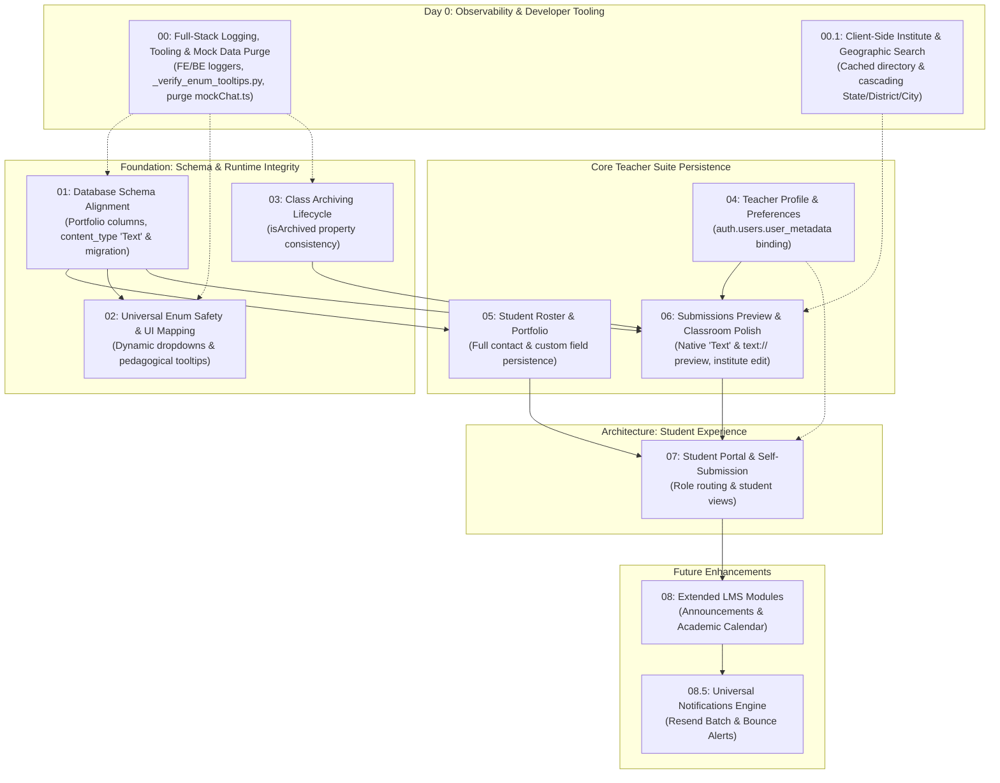

# Teach&Learn — LMS Architectural Remediation & Implementation Plans

Welcome to the modular implementation planning and execution directory for **Teach&Learn LMS**. 

Following the AI/RAG decoupling (tag `ui/lms-only-development`), this directory divides all identified bugs, schema discrepancies, unpersisted forms, and architectural gaps into discrete, reviewable engineering plans and tracks their live implementation progress.

---

## 📊 Live Remediation Progress Dashboard

| Metric | Current Status |
| :--- | :--- |
| **Total Plans** | **11 Plans** (Phase 0 through Phase 4) |
| **Plans Completed** | **3 / 11** (`27%`) |
| **Plans In Progress** | **0 / 11** (`0%`) |
| **Plans Pending Execution** | **8 / 11** (`73%`) |
| **Current Execution Target** | [**`Plan 02: Universal Database Enum Safety & Dynamic UI Mapping`**](./02-instruction-type-enum-safety.md) |
| **System Readiness** | Pure LMS mode active; AI triggers decoupled; all plan files verified and aligned. |

---

## Plan Directory & Execution Dependency Graph

The remediation is organized into independent yet logically sequenced plan files:

---

## Master Implementation & Progress Tracker

| Plan File | Scope & Title | Phase | Priority | Status | Progress | Verification Status | Notes |
| :--- | :--- | :---: | :---: | :---: | :---: | :---: | :--- |
| [**`00-enum-tooltip-audit-tooling.md`**](./00-enum-tooltip-audit-tooling.md) | Developer Tooling, Enum Verification, Full-Stack Logging & Mock Data Purge | Phase 0 | `TOOLING` | ✅ Completed | `100%` | 🟢 Verified | Foundation: establishes `./logs/` streaming, Vite HMR, and `mockChat.ts` purge. |
| [**`00.1-client-side-institute-geographic-search.md`**](./00.1-client-side-institute-geographic-search.md) | Client-Side Institute & Cascading Geographic Search | Phase 0 | `UX/PERF` | ✅ Completed | `100%` | 🟢 Verified | Replaces 5 round-trip RPCs with client cache & 780-district static hierarchy. |
| [**`01-database-schema-alignment.md`**](./01-database-schema-alignment.md) | Database Schema Alignment, Portfolio Migration & `content_type` `'Text'` | Phase 1 | `CRITICAL` | ✅ Completed | `100%` | 🟢 Verified | Adds portfolio columns to `class_students`, adds `'Text'` to enum, relaxes validator. |
| [**`02-instruction-type-enum-safety.md`**](./02-instruction-type-enum-safety.md) | Universal Database Enum Safety & Dynamic UI Mapping | Phase 1 | `CRITICAL` | ⏳ Pending | `0%` | ⬜ Unverified | Dynamic `Constants.public.Enums` dropdowns, multiselects, and `enumTooltips.ts`. |
| [**`03-class-archiving-lifecycle.md`**](./03-class-archiving-lifecycle.md) | Class Archiving Lifecycle & State Standardization | Phase 2 | `HIGH` | ⏳ Pending | `0%` | ⬜ Unverified | Standardizes `isArchived` (client) and `is_archived` (database) across hooks and sidebar. |
| [**`04-teacher-profile-preferences.md`**](./04-teacher-profile-preferences.md) | Teacher Profile & Teaching Preferences Persistence | Phase 2 | `LOW` | ⏳ Pending | `0%` | ⬜ Unverified | Binds settings modals to `user_metadata` and configurable `lateAttendanceWeight`. |
| [**`05-student-roster-portfolio-persistence.md`**](./05-student-roster-portfolio-persistence.md) | Student Roster & Portfolio Persistence | Phase 2 | `CRITICAL` | ⏳ Pending | `0%` | ⬜ Unverified | Full CRUD for contact, parent, and accommodation fields in `studentService.ts`. |
| [**`06-submissions-materials-preview.md`**](./06-submissions-materials-preview.md) | Submission Previews, Native 'Text' Uploads, Edit Mode Polish & State Hygiene | Phase 2 | `MEDIUM` | ⏳ Pending | `0%` | ⬜ Unverified | Polymorphic preview reader, native text turn-in, institute edit mode, report card state. |
| [**`07-student-portal-architecture.md`**](./07-student-portal-architecture.md) | Dedicated Student Portal, Student RLS Overhaul & Role-Based Routing | Phase 3 | `ARCHITECTURAL` | ⏳ Pending | `0%` | ⬜ Unverified | Student RLS overhaul, role router in `App.tsx`, `StudentApp.tsx`, self-turn-in modal. |
| [**`08-extended-lms-modules.md`**](./08-extended-lms-modules.md) | Extended LMS Modules: Announcements & Academic Calendar | Phase 4 | `FUTURE` | ⏳ Pending | `0%` | ⬜ Unverified | Class announcements schema & UI feed; interactive calendar aggregating `due_at`. |
| [**`08.5-classroom-notifications-resend.md`**](./08.5-classroom-notifications-resend.md) | Universal Classroom Notifications, Resend Delivery Engine & Bounce Tracking | Phase 4 | `FUTURE` | ⏳ Pending | `0%` | ⬜ Unverified | Multi-event Resend batch engine, `public.notification_logs`, bounce alerts to teacher. |

---

## Phase-by-Phase Execution Milestones

### Phase 0: Developer Tooling, Observability & Data Performance
- [x] **Plan 00**: Implement `scripts/_verify_enum_tooltips.py`, `frontend/src/lib/logger.ts`, `backend/src/lib/logger.py`, and delete `mockChat.ts`.
- [x] **Plan 00.1**: Implement `frontend/src/data/geography.ts` and `frontend/src/services/instituteService.ts`.

### Phase 1: Database Schema & Enum Runtime Integrity
- [x] **Plan 01**: Apply schema migration for portfolio columns, `content_type` `'Text'`, and regenerate types via `_generate_types.py`.
- [ ] **Plan 02**: Eliminate hardcoded enum literals in `ClassDetails.tsx` and create `frontend/src/utils/enumTooltips.ts`.

### Phase 2: Core Teacher Suite Lifecycle & Portfolio Persistence
- [ ] **Plan 03**: Align `isArchived` across `useClassOperations.ts`, `classService.ts`, and `Sidebar.tsx`.
- [ ] **Plan 04**: Connect `AccountModals.tsx` to `AuthContext.updateUserMetadata` and wire late attendance weight.
- [ ] **Plan 05**: Enable full portfolio CRUD in `studentService.ts` and unblock persistence gate in `StudentRegister.tsx`.
- [ ] **Plan 06**: Implement polymorphic previews in `MaterialPreviewModal.tsx`, institute edit mode, and calculation fixes.

### Phase 3: Dedicated Student Experience & Role-Based Routing
- [ ] **Plan 07**: Overhaul PostgreSQL RLS for enrolled students, implement `App.tsx` role routing, `StudentApp.tsx`, and `StudentTurnInModal.tsx`.

### Phase 4: Extended LMS Modules & Universal Notifications
- [ ] **Plan 08**: Implement `public.announcements` schema, teacher composer, student notice feed, and `CalendarView.tsx`.
- [ ] **Plan 08.5**: Implement `public.notification_logs`, Resend batch Edge Functions (`notify-announcement`, `notify-material`, `notify-submission`), and `resend-webhook` bounce alert handler.

---

## Status Legend & Tracking Conventions

- ⏳ **Pending**: Design approved, awaiting scheduled execution.
- 🚧 **In Progress**: Code changes actively being implemented.
- 🔍 **In Review / Verification**: Code written; undergoing automated linting (`npm run build`, `basedpyright`), test suites, and manual verification.
- ✅ **Completed**: Implemented, verified, and documented with updated `code.DESC.md` and `code.ARCH.md`.

---

## Revision & Review Workflow

1. Each plan can be inspected, debated, and revised individually.
2. Once a plan is marked `Approved`, its code modifications can be executed and verified with zero side-effects on adjacent plans.
3. Every step adheres strictly to the repository's universal rules:
   - Zero modifications to generated `db.ts` or `db.py` (Rule 2.5).
   - Simplification and elimination of redundant tables or states (Rule 3).
   - Build verification (`npm run build`, `uv run poe lint`) before marking any step complete (Rule 2.7).
   - Directory-level documentation maintenance (`code.DESC.md` / `code.ARCH.md`) on file additions/edits (Rule 5).
