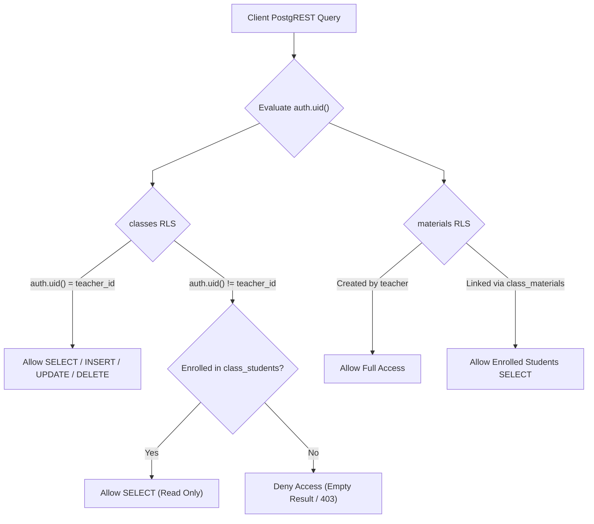

# Database Architecture & Security Contracts

This document details the PostgreSQL schema architecture, Row Level Security (RLS) policies, foreign key indexing strategies, and LangGraph storage models in `schema/`.

---

## 1. Multi-Tenant Security & RLS Execution Architecture

---

## 2. DDL Design Patterns & Indexing Invariants

1. **Foreign Key Indexing Requirement**:
   As mandated in [`AGENTS.md`](file:///home/victor/antigravity/Teacher-Assistant-Workspace/schema/AGENTS.md), **every foreign key column contains an explicit B-tree index** (e.g. `idx_classes_teacher_id`, `idx_class_materials_class_id`, `idx_student_submissions_student_id`) to prevent table-scan locks during cascade operations and join queries.
2. **UUID Primary Keys & Timestamps**:
   - Primary keys utilize `UUID PRIMARY KEY DEFAULT gen_random_uuid()`.
   - Audit columns (`created_at`, `updated_at`) are attached to all domain tables with automatic `moddatetime` update triggers.
3. **JSONB Content Architecture**:
   - `materials.content` and `student_submissions.content` use structured JSONB arrays supporting mixed media types (`File`, `URL`, `Text`) with UUID identifiers for file path resolution.
4. **Automated Grade Aggregation Trigger**:
   - `trg_sync_student_scores` executes on `student_submissions` after INSERT, UPDATE (score), or DELETE to atomically recompute `current_score`, `current_grade`, and `performance_tier` in `public.class_students`.
5. **Class-Scoped Material & Submission RPCs**:
   - `unlink_material_from_class`: Safely removes class-material links without destroying shared global materials or past submissions.
   - `delete_material`: Removes material DB rows and uses reference counting across all materials' `content` JSONB arrays to only return physical storage paths for deletion when no other material or class references that file.
   - `delete_submission_atomic`: Removes submission DB rows and returns storage paths for physical blob cleanup in Supabase Storage.
6. **LangGraph Checkpoint Isolation**:
   - LangGraph checkpoint tables are stored in the dedicated `langgraph` schema, preventing agent execution metadata from interfering with domain queries in `public`.
7. **Hybrid Vector & Ontological Knowledge Architecture (`ai` Schema)**:
   - Vector store tables (`material_embeddings`, `submission_embeddings`) use `pgvector` with HNSW cosine similarity indexing for fast RAG retrieval.
   - Ontological graph tables (`ontology_concepts`, `ontology_relationships`, `ontology_misconceptions`) maintain directed prerequisite hierarchies and learning standards.
   - `material_concept_mappings` connects material chunks and vector embeddings directly to pedagogical concepts.
   - `student_concept_mastery` maintains dynamic student-level mastery scores and detected learning gaps.
   - All `ai` tables are shielded from public PostgREST API exposure and accessed securely via `public` RPC gateway functions (`get_submission_ai_diagnostic`, `get_material_ai_insights`, `get_student_concept_gaps`, `get_class_concept_matrix`).

