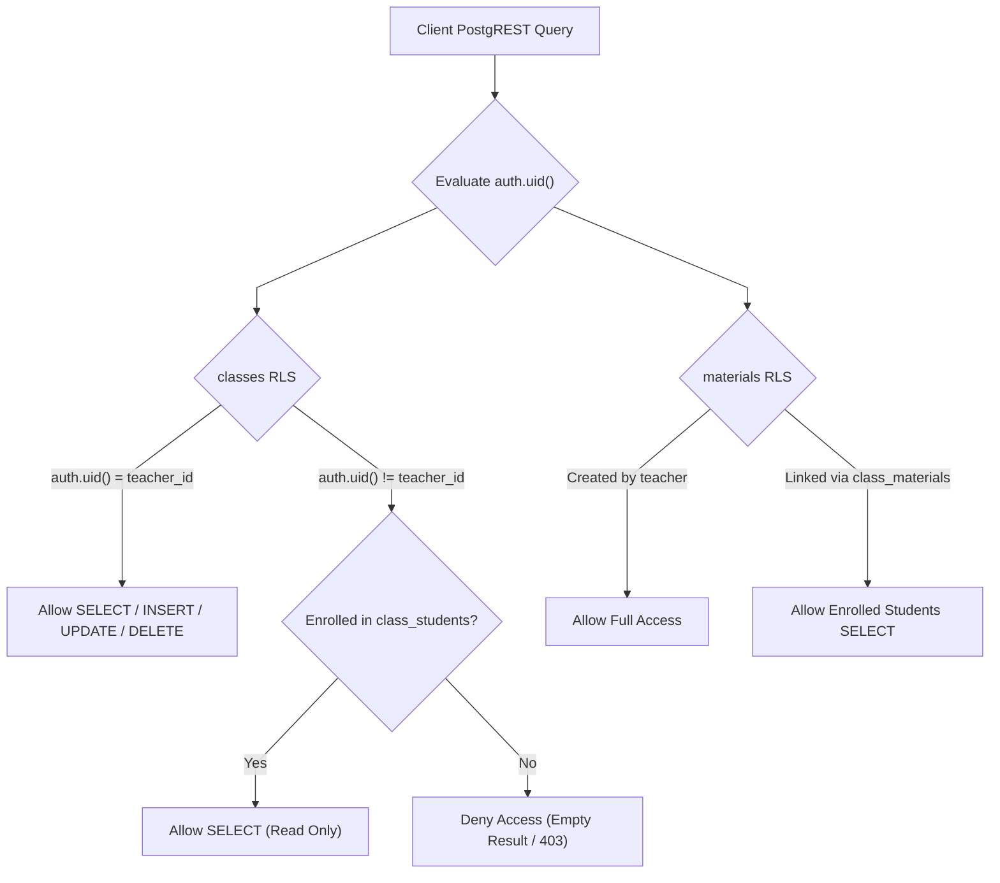

# Database Architecture & Security Contracts

This document details the PostgreSQL schema architecture, Row Level Security (RLS) policies, foreign key indexing strategies, and LangGraph storage models in `schema/`.

---

## 1. Multi-Tenant Security & RLS Execution Architecture

```mermaid
%%{init: {'flowchart': {'curve': 'linear'}}}%%
flowchart TD
    Client["Client PostgREST Query"] --> AuthEngine{"Evaluate auth.uid()"}
    
    AuthEngine --> ClassesPolicy{"classes RLS"}
    ClassesPolicy -- "auth.uid() = teacher_id" --> PermitOwner["Allow SELECT / INSERT / UPDATE / DELETE"]
    ClassesPolicy -- "auth.uid() != teacher_id" --> CheckStudent{"Enrolled in class_students?"}
    CheckStudent -- Yes --> PermitReadOnly["Allow SELECT (Read Only)"]
    CheckStudent -- No --> Deny["Deny Access (Empty Result / 403)"]

    AuthEngine --> MaterialsPolicy{"materials RLS"}
    MaterialsPolicy -- "Created by teacher" --> AllowTeacher["Allow Full Access"]
    MaterialsPolicy -- "Linked via class_materials" --> AllowEnrolled["Allow Enrolled Students SELECT"]
```

---

## 2. DDL Design Patterns & Indexing Invariants

1. **Foreign Key Indexing Requirement**:
   As mandated in [`AGENTS.md`](file:///home/victor/antigravity/Teacher-Assistant-Workspace/schema/AGENTS.md), **every foreign key column contains an explicit B-tree index** (e.g. `idx_classes_teacher_id`, `idx_class_materials_class_id`, `idx_student_submissions_student_id`) to prevent table-scan locks during cascade operations and join queries.
2. **UUID Primary Keys & Timestamps**:
   - Primary keys utilize `UUID PRIMARY KEY DEFAULT gen_random_uuid()`.
   - Audit columns (`created_at`, `updated_at`) are attached to all domain tables with automatic `moddatetime` update triggers.
3. **JSONB Content Architecture**:
   - `materials.content` and `student_submissions.content` use structured JSONB arrays supporting mixed media types (`File`, `URL`, `Text`) with UUID identifiers for file path resolution.
   - The `validate_content_array` check function requires `id` and valid `type` across all entries, and mandates a non-empty `path` strictly for `File` and `URL` types while allowing `Text` items to omit storage paths.
4. **Student Identity Contact vs. Class-Scoped Portfolio & Accommodations**:
   - Identity-level student contact and guardian details (`phone`, `address`, `parent_name`, `parent_contact`) are stored on `public.students` (editable by both the student and enrolled class teachers via RLS).
   - Class-scoped observations, roll numbers, and extensible teacher accommodations are stored on `public.class_students` (`parent_notes`, `custom_fields`, `roll_number`).
   - `custom_fields` stores teacher-defined key-value accommodations (e.g. IEP accommodations, medical notes) as structured JSONB (`[{"name": "...", "value": "..."}]`).
5. **Automated Database Triggers**:
   - `trg_sync_student_scores`: Executes `public.sync_student_class_scores()` on `student_submissions` after INSERT, UPDATE (score), or DELETE to atomically recompute `current_score`, `current_grade`, and `performance_tier` in `public.class_students`.
   - `trg_auto_set_to_be_scored`: Executes `public.auto_set_to_be_scored()` on `materials` before INSERT or UPDATE to automatically set `to_be_scored = true` for `'Practical'`, `'Assignment'`, `'Test'`, or `'Exam'` categories.
   - `on_auth_user_created`: Executes `public.handle_new_user()` on `auth.users` after INSERT to auto-provision records in `public.students` for student-role signups.
   - `on_auth_user_updated`: Executes `public.handle_user_update()` on `auth.users` after UPDATE to synchronize student email and name changes into `public.students`.
   - `trg_*_updated_at`: Bound to all operational tables (`classes`, `templates`, `materials`, `instructions`, `students`, `class_students`, `attendance_records`, `student_submissions`, `class_materials`, `class_instructions`, `template_materials`, `template_instructions`, `announcements`, `notification_logs`, `chat_sessions`) via `public.set_updated_at()` to keep UTC timestamps synchronized.
6. **Class-Scoped Material & Operations RPCs**:
   - `unlink_material_from_class(p_class_id UUID, p_material_id UUID)`: Safely removes class-material links without destroying shared global materials or past submissions.
   - `delete_material(p_material_id UUID)`: Removes material DB rows and uses reference counting across all materials' `content` JSONB arrays to only return physical storage paths for deletion when no other material or class references that file.
   - `delete_submission_atomic(p_submission_id UUID)`: Removes submission DB rows and returns storage paths for physical blob cleanup in Supabase Storage.
   - `archive_material(p_material_id UUID)`: Sets `is_archived = true` on the material.
   - `add_student_to_class(p_class_id UUID, p_student_id UUID, ...)`: Upserts class enrollment into `public.class_students` with initial score, tier, and learning style profile.
   - `update_material_contents(p_table_name TEXT, p_record_id UUID, p_diff_array JSONB)`: Applies diff-based updates to JSONB `content` arrays in `materials` or `student_submissions` and returns deleted storage paths for cleanup.
   - `check_workspace_modifications(p_client_timestamps JSONB)` / `get_workspace_last_modified(p_client_timestamps JSONB)`: Granular SWR cache verification engine comparing client timestamps across classes, templates, students, materials, and instructions.
   - Fuzzy Directory Search RPCs: `search_institutes`, `search_districts`, `search_cities`, `search_states`, and `search_countries` using `pg_trgm.word_similarity` for auto-complete.
7. **LangGraph Checkpoint Isolation**:
   - LangGraph checkpoint tables are stored in the dedicated `langgraph` schema, preventing agent execution metadata from interfering with domain queries in `public`.
8. **Hybrid Vector & Ontological Knowledge Architecture (`ai` Schema)**:
   - Vector store tables (`material_embeddings`, `submission_embeddings`) use `pgvector` with HNSW cosine similarity indexing for fast RAG retrieval.
   - Ontological graph tables (`ontology_concepts`, `ontology_relationships`, `ontology_misconceptions`) maintain directed prerequisite hierarchies and learning standards.
   - `material_concept_mappings` connects material chunks and vector embeddings directly to pedagogical concepts.
   - `student_concept_mastery` maintains dynamic student-level mastery scores and detected learning gaps.
   - All `ai` tables are shielded from public PostgREST API exposure and accessed securely via `public` RPC gateway functions (`get_submission_ai_diagnostic`, `get_material_ai_insights`, `get_student_concept_gaps`, `get_class_concept_matrix`). Automatic event triggers (`trg_material_ai_analysis`, `trg_submission_ai_eval`) are decoupled from uploads and can be manually reconnected or triggered on demand.
9. **Infrastructure PostgreSQL Extensions**:
   - `vector` (`pgvector`): Semantic vector embeddings (1536 dims) and HNSW cosine distance indexing in `ai` schema.
   - `pg_trgm`: Trigram string similarity functions powering fuzzy autocomplete RPCs (`search_*`).
   - `pgcrypto`: Cryptographic UUID generation (`gen_random_uuid()`) for primary keys and tokens.
   - `pg_net`: Asynchronous HTTP networking extension in `net` schema for background webhooks and Edge Function triggers.

