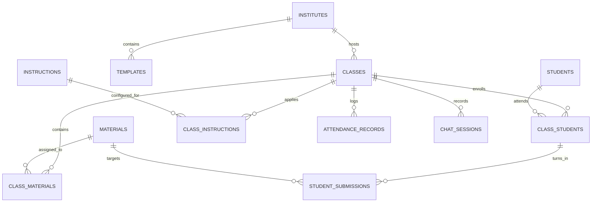

# Database Schemas & DDL — `schema/`

This directory contains the PostgreSQL Data Definition Language (DDL) scripts, storage bucket definitions, Row Level Security (RLS) policies, and database reset routines for the Teach&Learn platform.

---

## 📁 Directory Files

- [`schema-db.sql`](file:///home/victor/antigravity/Teacher-Assistant-Workspace/schema/schema-db.sql): Core application DDL defining custom PostgreSQL ENUMs, core tables (`institutes`, `classes`, `templates`, `students`, `materials`, `instructions`), junction tables (`class_students`, `class_materials`, `class_instructions`, `template_materials`, `template_instructions`), tracking tables (`student_submissions`, `attendance_records`, `chat_sessions`), foreign key constraints, indexes on all foreign keys, automatic score recalculation trigger (`trg_sync_student_scores`), RPC helper functions (`unlink_material_from_class`, `archive_material`, `delete_submission_atomic`, `delete_material`), and strict user-scoped Row Level Security (RLS) policies.
- [`schema-ai.sql`](file:///home/victor/antigravity/Teacher-Assistant-Workspace/schema/schema-ai.sql): Hybrid vector & ontological knowledge graph DDL in the private `ai` schema. Contains `material_embeddings` and `submission_embeddings` (HNSW indexed with `pgvector`), `ontology_concepts`, `ontology_relationships`, `ontology_misconceptions`, `material_concept_mappings`, `student_concept_mastery`, `material_insights`, `submission_evaluations`, strict RLS policies, automated `pg_net` evaluation triggers (`trg_submission_ai_eval`, `trg_material_ai_analysis`), and public gateway RPCs (`get_submission_ai_diagnostic`, `get_material_ai_insights`, `get_student_concept_gaps`, `get_class_concept_matrix`).
- [`schema-langgraph.sql`](file:///home/victor/antigravity/Teacher-Assistant-Workspace/schema/schema-langgraph.sql): Configures RLS policies, ownership constraints, and indexes for the LangGraph state checkpointing and conversation store tables within the isolated `langgraph` schema.
- [`bucket-materials.sql`](file:///home/victor/antigravity/Teacher-Assistant-Workspace/schema/bucket-materials.sql): Creates the private `class-materials` Supabase Storage bucket with 50MB file size limits, MIME type restrictions, and RLS policies scoped to teacher user IDs.
- [`bucket-submissions.sql`](file:///home/victor/antigravity/Teacher-Assistant-Workspace/schema/bucket-submissions.sql): Creates the private `student-submissions` Supabase Storage bucket with RLS policies allowing enrolled students to upload/view their own work and teachers to review submissions for their classes.
- [`schema-reset.sql`](file:///home/victor/antigravity/Teacher-Assistant-Workspace/schema/schema-reset.sql): Database teardown script that cleanly drops all application tables, enums, triggers, `ai` schema, and helper functions in reverse dependency order for reproducible local resets.
- [`AGENTS.md`](file:///home/victor/antigravity/Teacher-Assistant-Workspace/schema/AGENTS.md): Subsystem-specific rules for DDL design, mandatory RLS policies, indexing requirements, and naming conventions.

---

## 🏛️ Domain Enumerations (ENUMs)

- **`content_category`**: `Study Material`, `Note`, `Assigned Book`, `Link`, `Practical`, `Assignment`, `Test`, `Exam`
- **`content_type`**: `File`, `URL`, `Text`
- **`submission_status`**: `Assigned`, `Pending`, `Submitted`, `Evaluated`, `Graded`
- **`attendance_status`**: `Present`, `Absent`, `Late`, `Excused`
- **`experience_level`**: `Beginner`, `Intermediate`, `Advanced`, `Mixed`
- **`teaching_style`**: `Lecture`, `Socratic Method`, `Interactive`, `Project-Based`, `Flipped Classroom`, `Discussion-Based`, `Hands-On`
- **`assessment_preference`**: `Multiple Choice`, `Short Answer`, `Essays`, `Presentations`, `Single Project`, `Group Projects`, `Oral Exams`, `Peer Review`
- **`instruction_type`**: `System Persona`, `Grading Rubric`, `Lesson Plan Guideline`, `Material Generation Rule`, `Student Interaction Rule`, `Assessment Creation Rule`, `Content Filtering Rule`, `General Policy`

---

## 🗄️ Relational Entity Model

---

## 📦 Storage Bucket Architecture

- **`class-materials` Bucket**: Path pattern `/{teacher_user_id}/{material_id}/{content_item_id}`. Managed directly by teachers via RLS; students retrieve signed URLs via `get-material-url`.
- **`student-submissions` Bucket**: Path pattern `/{material_id}/{content_item_id}`. Uploaded by enrolled students, reviewed by class teachers.

For detailed indexing strategies, RLS execution architecture, and LangGraph schema isolation, see [`code.ARCH.md`](file:///home/victor/antigravity/Teacher-Assistant-Workspace/schema/code.ARCH.md).
