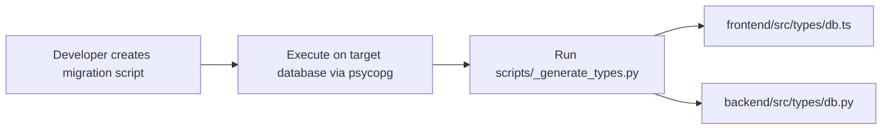

# Database Migrations Architecture — `schema/migrations/`

This document details the architectural conventions, execution order, and idempotency guarantees for database migrations.

---

## 1. Migration Lifecycles & Execution Flow

## 2. Invariants & Rules

1. **Sequential Naming**: Migrations follow a zero-padded 3-digit prefix: `001_...sql`, `002_...sql`.
2. **Idempotency**: DDL commands MUST use `IF NOT EXISTS` / `IF EXISTS` where supported (`ADD COLUMN IF NOT EXISTS`, `ADD VALUE IF NOT EXISTS`).
3. **Autocommit for Enum Additions**: Adding values to PostgreSQL enums via `ALTER TYPE ... ADD VALUE` cannot execute within multi-statement transaction blocks in pooled connections. Scripts modifying enums must execute with `autocommit=True`.
4. **Canonical Schema Synchronization**: Any migration applied here MUST be simultaneously reflected in [`schema/schema-db.sql`](file:///home/victor/antigravity/Teacher-Assistant-Workspace/schema/schema-db.sql) or [`schema/schema-ai.sql`](file:///home/victor/antigravity/Teacher-Assistant-Workspace/schema/schema-ai.sql) so that freshly initialized databases mirror migrated ones.
