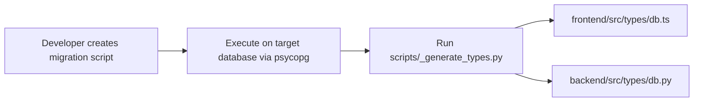

# Database Migrations Architecture — `schema/migrations/`

This document details the architectural conventions, execution order, and idempotency guarantees for database migrations.

---

## 1. Migration Lifecycles & Execution Flow

```mermaid
flowchart LR
    Dev["Developer creates migration script"] --> LocalRun["Execute on target database via psycopg"]
    LocalRun --> GenTypes["Run scripts/_generate_types.py"]
    GenTypes --> TS["frontend/src/types/db.ts"]
    GenTypes --> Py["backend/src/types/db.py"]
```

## 2. Invariants & Rules

1. **Sequential Naming**: Migrations follow a zero-padded 3-digit prefix: `001_...sql`, `002_...sql`.
2. **Idempotency**: DDL commands MUST use `IF NOT EXISTS` / `IF EXISTS` where supported (`ADD COLUMN IF NOT EXISTS`, `ADD VALUE IF NOT EXISTS`).
3. **Autocommit for Enum Additions**: Adding values to PostgreSQL enums via `ALTER TYPE ... ADD VALUE` cannot execute within multi-statement transaction blocks in pooled connections. Scripts modifying enums must execute with `autocommit=True`.
4. **Canonical Schema Synchronization**: Any migration applied here MUST be simultaneously reflected in [`schema/schema-db.sql`](file:///home/victor/antigravity/Teacher-Assistant-Workspace/schema/schema-db.sql) or [`schema/schema-ai.sql`](file:///home/victor/antigravity/Teacher-Assistant-Workspace/schema/schema-ai.sql) so that freshly initialized databases mirror migrated ones.

---

## 3. Migration Scope & Schema Evolution Catalog

| Migration | Target Objects | Core Changes & Security Invariants |
| :--- | :--- | :--- |
| **`001`** | `class_students`, `content_type`, `validate_content_array` | Adds student portfolio columns, extends `content_type` ENUM with `'Text'`, relaxes content validation for inline text answers. |
| **`002`** | `classes`, `materials`, `class_materials`, `class_instructions`, `student_submissions` | Grants enrolled student read access (`SELECT`) and assignment turn-in permissions (`INSERT`/`UPDATE` own work) under RLS. |
| **`003`** | `announcements` | Creates classroom bulletin table with RLS permitting teacher full CRUD and enrolled student read access. |
| **`004`** | `notification_logs` | Outbound email audit log recording recipient metadata and Resend message statuses (`queued`, `delivered`, `bounced`, etc.). |
| **`005`** | `is_class_teacher(lookup_class_id UUID)` | Introduces `SECURITY DEFINER` helper to decouple RLS subqueries between `classes` and `class_students` to eliminate mutual recursion. |
| **`006`** | `set_updated_at()`, `check_workspace_modifications(jsonb)`, `get_workspace_last_modified(jsonb)` | Adds `updated_at` timestamps across all 11 tables with automatic `BEFORE UPDATE` triggers and an SWR cache revalidation RPC engine. |
| **`007`** | `students`, `class_students` | Migrates identity and contact columns (`phone`, `address`, `parent_name`, `parent_contact`) from `class_students` to `students` and adjusts `students` RLS. |
